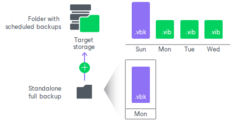
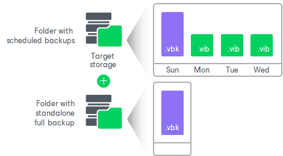

# Standalone Full Backup

Sometimes you need to create a full backup of your data. For example, you may want to save a copy of your data on a CD or DVD or create a full backup of all data on your computer at some point in time. In these situations, you can perform standalone full backup.

When Veeam Agent for Microsoft Windows performs standalone full backup, it produces a full backup of your data in a separate folder in the target location. The standalone full backup is not associated with subsequent incremental backups. You can use it as an independent restore point for data recovery.

To create a standalone full backup, Veeam Agent for Microsoft Windows uses settings specified for the backup job. For example, if you have configured the backup job to perform backup of a specific volume, the standalone full backup will create a full backup of this volume in a separate folder in the target location.

Unlike the backup job started upon schedule, the standalone full backup task is not retried automatically. If standalone full backup fails for some reason, you will have to start the standalone full backup task manually again.

The standalone full backup is not removed by retention. To remove it, you must manually delete the full backup file from disk.

|  |
| --- |
| NOTE |
| You cannot perform standalone full backup if the backup job is targeted at one of the following locations:   * Veeam backup repository * Veeam Cloud Connect repository * Object storage |

Standalone Full Backup to Another Location

You can create a standalone full backup in a separate location that is not specified as a target location in the backup job settings. For example, you may want to save a copy of your data on a removable storage device while your scheduled backup job is targeted at the network shared folder.

Backup to another location practically does not differ from regular standalone full backup. The only difference is that you must manually select a target location in which Veeam Agent for Microsoft Windows will save the backup file. You can save backup files to the following locations:

* Removable storage device
* Local computer drive
* Network shared folder

You cannot use a Veeam backup repository or Veeam Cloud Connect repository as a target for backup to another location.

Related Topics

* [Active Full Backup](active_full_backup.md)
* [Synthetic Full Backup](synthetic_full_backup.md)

Related Tasks

* [Creating Standalone Full Backups](backup_standalone_full.md)

* [Performing Backup to Another Location](backup_standalone_full_location.md)

