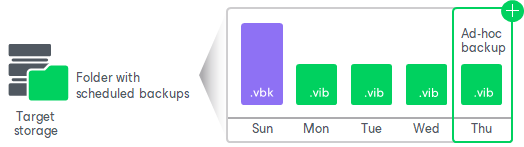

# Ad-Hoc Incremental Backup

If you want to create a new backup of your data in addition to backups created with the scheduled backup job, you can perform ad-hoc incremental backup. Ad-hoc incremental backup adds a new restore point to the backup chain. For example, you may want to back up your data before you install new software on your computer or enable a new feature.

For ad-hoc incremental backup, Veeam Agent for Microsoft Windows uses settings specified for the backup job. For example, if you have configured the backup job to perform backup of a specific volume, the ad-hoc incremental backup operation will create an incremental backup of this volume and save it in the target location, next to existing backup files in the backup chain.

Unlike the backup job started upon schedule, the ad-hoc incremental backup task is not retried automatically. If the task fails for some reason, you will have to start it manually again.

Veeam Agent for Microsoft Windows treats restore points created by ad-hoc incremental backup as regular restore points, and applies to them retention policy settings specified for the backup job. To learn more, see [Backup Retention Policy](retention.md).

Related Tasks

[Creating Incremental Backups](backup_incremental.md)

