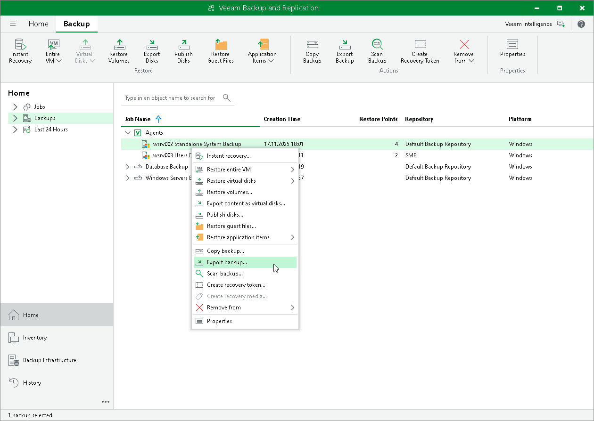

# Exporting Restore Point to Full Backup File

You can restore data from a specific restore point in a Veeam Agent backup and export this data to a standalone full backup file. The procedure of Veeam Agent backup export does not differ from the same procedure for a VM. To learn more, see the [Exporting Backups](https://helpcenter.veeam.com/docs/vbr/userguide/exporting_backups.html?ver=13) section in the Veeam Backup & Replication User Guide.

