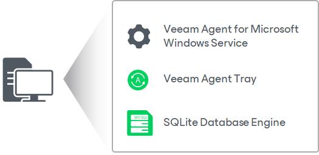

# Solution Architecture

Veeam Agent for Microsoft Windows is set up on a computer whose data you want to protect.

Veeam Agent for Microsoft Windows has a one-service architecture. When you install the product, Veeam Agent deploys the following components on the computer:

* Veeam Agent for Microsoft Windows Service is a Microsoft Windows service responsible for performing all types of backup and restore tasks. The service is started automatically when you power on the computer, and runs in the background under the Local System account.
* Veeam Agent Tray is a tray agent that communicates with the Veeam Agent for Microsoft Windows Service to let you monitor the backup operation status and provide quick access to main functions of Veeam Agent for Microsoft Windows: starting backup and restore operations, viewing statistics for created backups and so on. The Veeam Agent Tray starts when you log on to the system and runs in the background.
* To store its configuration data, Veeam Agent uses the SQLite database engine. SQLite requires only few files to install and takes little resources to run.

|  |
| --- |
| NOTE |
| The account under which Veeam Agent for Microsoft Windows Service runs should not be changed. Configurations with custom account are not supported. |

