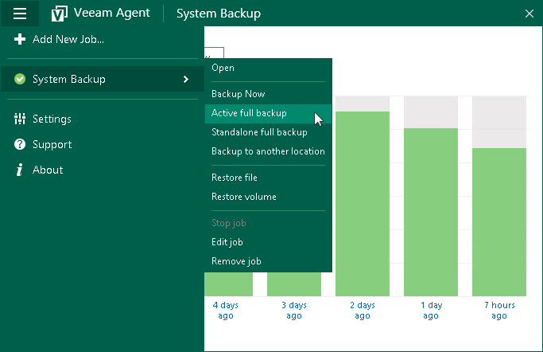

# Creating Active Full Backups

You can create an ad-hoc full backup — active full backup, and add it to the backup chain on the target storage. The active full backup resets the backup chain. All subsequent incremental backups use the active full backup as a starting point. The previously used full backup will remain on the target storage until it is removed from the backup chain according to the retention policy.

|  |
| --- |
|  IMPORTANT |
| If you have a file-level backup job configured in Veeam Agent and you need to extend the volume where backed-up files reside, we strongly recommend to create an active full backup after the volume is extended. Otherwise, Veeam Agent may skip files during the job run even if these files are added to the backup scope. |

Before you create an active full backup, check the following prerequisites:

* The backup job must be configured.
* You cannot create an active full backup if a backup task of any type is currently running. This includes a scheduled backup, standalone full backup, active full backup or ad-hoc incremental backup.

* A user account under which you start the Active full backup operation must have administrative privileges on the Veeam Agent computer. If the account under which you are currently logged on to Microsoft Windows does not have administrative privileges, you will be prompted to enter administrator credentials.

To perform active full backup:

1. Double-click the Veeam Agent for Microsoft Windows icon in the system tray or right-click it and select Control Panel.
2. In the main menu, hover over the name of the backup job that you want to use to create an active full backup, and select Active full backup. Veeam Agent for Microsoft Windows will create a full backup file using settings of the backup job and add this backup file to the backup chain.

If only one job is configured in Veeam Agent for Microsoft Windows, you can also start the active full backup task from the system tray menu:

1. Right-click the Veeam Agent for Microsoft Windows icon in the system tray.
2. Select Backup > Active full backup.

|  |
| --- |
|  NOTE |
| The Backup option is not available in the system tray menu if multiple backup jobs are configured in Veeam Agent for Microsoft Windows. |

Related Topics

[Active Full Backup](active_full_backup.md)

