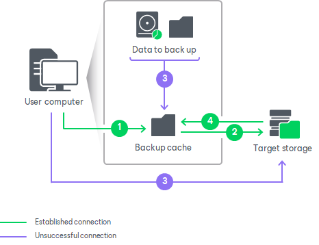

# How Backup Cache Works

When you create a backup job targeted at a remote storage, you can select to use the backup cache in its properties. The procedure of data backup with the backup cache enabled is performed in the following way:

1. The user enables the backup cache in the properties of the backup job targeted at a remote location.
2. During a regular backup job session, Veeam Agent for Microsoft Windows creates in the backup cache a map of data blocks on the remote location. Information about data blocks on the remote location is saved in a file with digests and stored in the folder C:\ProgramData\Veeam\EndpointData\CacheDigests.

Veeam Agent for Microsoft Windows will use the created digests to create incremental backup files in the backup cache when the remote storage itself is unavailable at the time of scheduled backup.

1. If the target location is unavailable at the time when the scheduled backup job must start, Veeam Agent for Microsoft Windows creates the new restore point in the backup cache.

The target location is considered as unavailable in the following conditions:

* [For network shared folder] Veeam Agent for Microsoft Windows Service that runs on the protected computer cannot connect to the network shared folder. In this case, Veeam Agent for Microsoft Windows will immediately start creating the new restore point in the backup cache.
* [For object storage] Veeam Agent for Microsoft Windows Service that runs on the protected computer cannot connect to the object storage.
* [For Veeam backup repository] Veeam Agent for Microsoft Windows Service cannot connect to the Veeam Backup Service that runs on the backup server to which the backup repository specified as a target location for Veeam Agent backups is connected.
* [For Veeam Cloud Connect repository] Veeam Agent for Microsoft Windows Service cannot connect to one of the following services on the Veeam Cloud Connect provider side:

* Veeam Backup Service that runs on the backup server used for managing the Veeam Cloud Connect infrastructure.

* Veeam Cloud Connect Service that runs on the backup server used for managing the Veeam Cloud Connect infrastructure.
* Veeam Cloud Gateway Service that runs on a cloud gateway deployed in the Veeam Cloud Connect infrastructure.

In case the connection to the target location is lost when the backup job is already running, Veeam Agent for Microsoft Windows performs backup based on the following rules:

* [For network shared folder] Veeam Agent for Microsoft Windows immediately switches to the backup cache and writes to the backup cache all data that must be backed up within the current backup job session. If some data has already been transferred to the target location, Veeam Agent for Microsoft Windows starts the data transfer operation from the beginning and transfers all backed-up data to the backup cache.
* [For object storage, Veeam backup repository and Veeam Cloud Connect repository] Veeam Agent for Microsoft Windows tries to reconnect to the target location. The reconnection process may last 30 minutes or more. After the reconnection period expires, Veeam Agent for Microsoft Windows switches to the backup cache and writes to the backup cache only remaining data that has not been transferred to the target location yet. Data that has been already transferred to the target location remains in the backup repository.

The process of data backup to the backup cache practically does not differ from the regular one. The difference is that the resulting backup file is saved to the local folder instead of the remote storage.

If the target location becomes available after Veeam Agent for Microsoft Windows has started creating a restore point in the backup cache, Veeam Agent for Microsoft Windows will not switch back to the target location. Instead, Veeam Agent for Microsoft Windows will create a restore point in the backup cache and then upload this restore point to the target location.

1. After the remote storage becomes available, Veeam Agent for Microsoft Windows uploads backup files that were created in the backup cache to the target location. If more than one restore point was created in the backup cache, these restore points are uploaded to the target location sequentially, one by one.

Until all restore points are uploaded from the backup cache to the target location, Veeam Agent for Microsoft Windows will continue to create new restore points in the backup cache even if the target location is available at the time when the backup job is running.

