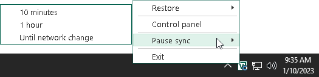

# Pausing Backup Cache Synchronization

After at least one restore point is created in the backup cache, Veeam Agent for Microsoft Windows starts monitoring availability of the target location. To perform this operation, Veeam Agent for Microsoft Windows starts the backup cache synchronization job that runs in the background.

The backup cache synchronization job can be paused automatically by Veeam Agent for Microsoft Windows or manually.

Veeam Agent pauses the backup cache synchronization job automatically in case Veeam Agent computer is put into sleep or hibernate mode during the job session, and the backup job is targeted at one of the following locations:

+ Local computer drive
+ Network shared folder

If the connection was lost during data transfer, Veeam Agent does not transfer all the data again. Instead, Veeam Agent continues data transfer that was started before the connection loss. After the connection is restored, Veeam Agent transfers only those data blocks that were not transferred before.

You can pause the backup cache synchronization job manually, for example, if you know that the target location will not become available for a while and want to reduce impact of Veeam Agent for Microsoft Windows on your OS performance.

To pause backup cache synchronization manually:

1. Right-click the Veeam Agent for Microsoft Windows icon in the system tray.
2. Select one of the following options:

* Pause sync > 10 minutes — to pause backup cache synchronization for 10 minutes.
* Pause sync > 1 hour — to pause backup cache synchronization for 1 hour.
* Pause sync > Until network change — to pause backup cache synchronization until new network settings are applied to the network adapter of the Veeam Agent computer.

