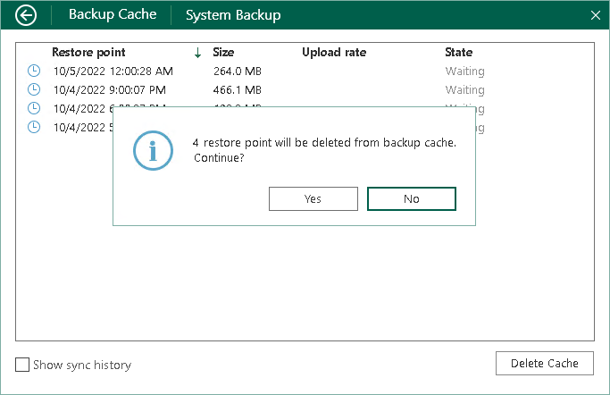

# Deleting Restore Points from Backup Cache

You can delete restore points from the backup cache manually if needed. For example, it is required to delete restore points after Veeam Agent for Microsoft Windows creates one or more restore points at the backup cache, and then you change the target location for backup files in the backup job settings.

To delete restore points from the backup cache:

1. Open the Backup Cache view in one of the following ways:

* [If the backup cache is enabled in the properties of one job] Right-click the Veeam Agent for Microsoft Windows icon in the system tray and select View cache.

|  |
| --- |
|  NOTE |
| The View cache option is not available in the system tray menu if the backup cache is enabled for more than one backup job configured in Veeam Agent for Microsoft Windows. |

* [If the backup cache is enabled in the properties of multiple jobs] Double-click the Veeam Agent for Microsoft Windows icon, or right-click the Veeam Agent for Microsoft Windows icon in the system tray and select Control Panel. In the main menu, hover over the name of the job that created restore points in the backup cache and select Open backup cache.

1. In the Backup Cache view, click Delete Cache.
2. In the window notifying that restore points will be deleted from the backup cache, click Yes.

|  |
| --- |
|  NOTE |
| The first backup job session following the deletion of restore points from the backup cache must complete successfully and create backup files on the target location. During this session, Veeam Agent for Microsoft Windows will create a new map of target location data blocks in the backup cache. If you delete restore points from the backup cache, and then run the backup job when the target location is unavailable, the backup job will fail. |

