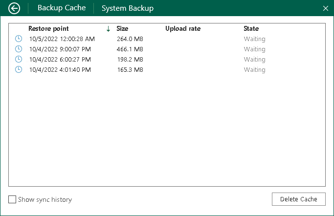
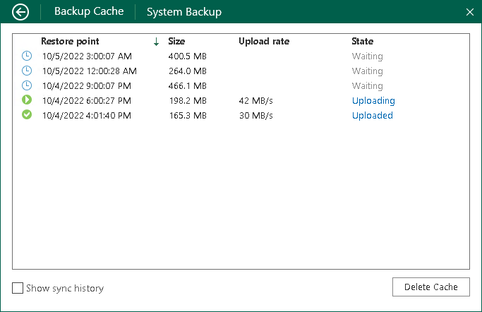

# Monitoring Backup Cache Activity

You can use the Veeam Agent control panel to view information about backup cache activity. In the Backup Cache view, Veeam Agent for Microsoft Windows displays a list of restore points that were created in the backup cache, their status and size of the resulting backup file. For restore points that are being uploaded or have been already uploaded to the target location, Veeam Agent for Microsoft Windows also displays the upload speed.

Viewing Restore Points in Backup Cache

To view information about backup cache activity, open the Backup Cache view in one of the following ways:

* If one backup job is configured:

Right-click the Veeam Agent for Microsoft Windows icon in the system tray and select View cache. The Veeam Agent control panel will open, and you will pass immediately to the Backup Cache view.

|  |
| --- |
| NOTE |
| The View cache option is not available in the system tray menu if more than one backup job is configured in Veeam Agent for Microsoft Windows. |

* If more than one backup job is configured:

Double-click the Veeam Agent for Microsoft Windows icon, or right-click the Veeam Agent for Microsoft Windows icon in the system tray and select Control Panel. In the main menu, hover over the name of the job that created restore points in the backup cache and select Open backup cache.

Viewing Backup Cache History

By default, the Backup Cache view contains a list of restore points that are waiting for upload or currently being uploaded to the target location. Restore points that have already been uploaded to the target location are not displayed in the list. To view such restore points, in the Backup Cache view, select the Show sync history check box.

Viewing Upload Details for Restore Points

For every restore point that is being uploaded or has been uploaded to the target location, you can also view detailed information on the upload process:

1. Open the Backup Cache view in one of the following ways:

* [If the backup cache is enabled in the properties of one job] Right-click the Veeam Agent for Microsoft Windows icon in the system tray and select View cache.
* [If the backup cache is enabled in the properties of multiple jobs] Double-click the Veeam Agent for Microsoft Windows icon, or right-click the Veeam Agent for Microsoft Windows icon in the system tray and select Control Panel. In the main menu, hover over the name of the job that created restore points in the backup cache and select Open backup cache.

1. In the Backup Cache view, click one of the following links next to the necessary restore point:

* Uploading — for a restore point that is currently being uploaded to the target location.
* Uploaded — for a restore point that has been already uploaded to the target location.

In the Upload details view, Veeam Agent for Microsoft Windows will provide detailed information about operations performed as part of the restore point upload process.

