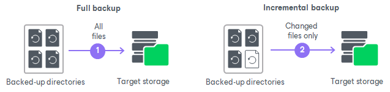

# Default Changed Block Tracking Mechanism

Veeam Agent for Microsoft Windows performs the changed block tracking differently depending on the backup type:

* [CBT for volume-level backup](#cbt_volume)
* [CBT for file-level backup](#cbt_file)

CBT for Volume-Level Backup

In case of the volume-level backup, Veeam Agent for Microsoft Windows performs changed block tracking in the following way:

1. During the full backup job session, Veeam Agent reads the Master File Table (MFT) of the backed-up volume. Veeam Agent uses MFT records to create digests with file system metadata, transfers the created digests to the target location and stores them to the resulting backup file.
2. During subsequent incremental job sessions, Veeam Agent performs the following operations:

1. Reads the Master File Table (MFT) of the backed-up volume and creates the new digests with file system metadata.
2. Interacts with the target backup location to obtain digests from the backup file that was created during the previous job session.
3. Compares new and previous digests to detect files whose data blocks have changed on the volume since the previous job session.

During incremental backup, Veeam Agent for Microsoft Windows reads from the VSS snapshot only data blocks pertaining to files that have changed since the previous job session. If Veeam Agent cannot calculate information about the changed files, for example, if it fails to retrieve digests from the backup file, Veeam Agent will need to read all data blocks from the VSS snapshot. As a result, the backup may take significantly more time.

|  |
| --- |
|  NOTE |
| Consider the following:   * Veeam Agent for Microsoft Windows uses the default CBT mechanism for NTFS volumes only. As a result, for volumes that use other file systems, incremental backup will require more time, because Veeam Agent for Microsoft Windows will read all data from the VSS snapshot to detect what blocks have changed since the last job session. * Changing the layout of the backed-up volume resets the changed block tracking. If this happens, Veeam Agent for Microsoft Windows creates a full backup of the entire volume during the next backup job run. |

CBT for File-Level Backup

In case of the file-level backup, Veeam Agent for Microsoft Windows performs changed block tracking in the following way:

1. During the full backup job session, Veeam Agent creates a new NTFS partition in the backup file. Veeam Agent uses this partition to store all backed-up files and folders.
2. During subsequent incremental job sessions, Veeam Agent performs the following operations:

1. Compares the last modification time attribute of files on the Veeam Agent computer and files in the backup. This operation allows Veeam Agent to detect files that have changed since the previous job session.
2. Transfers data blocks that contain metadata related to each changed file and its parent folders from the target backup location to the Veeam Agent computer.

If the backed-up file system has a complex folder structure with many hierarchy levels, and you back up data to a remote location, during incremental backup, the inbound network traffic on the Veeam Agent computer may exceed by far the outbound traffic. Significant amount of data can be transferred to the Veeam Agent computer even if few files are changed since the previous job session.

1. Replaces file system metadata in the downloaded data blocks with the current file system metadata.
2. Transfers data blocks with current metadata from the Veeam Agent computer to the target backup location along with changed files. In the target backup location, Veeam Agent stores data and metadata to the newly created backup file.

|  |
| --- |
|  NOTE |
| Consider the following:   * Veeam Agent for Microsoft Windows detects changed files using the last modification time attribute. If you change the file in any way, but the last modification time attribute remains unchanged, Veeam Agent will not back up this file during an incremental job session. * If the backed-up file has changes, Veeam Agent will copy to the target location not only changed data blocks of the file but the entire file. To save space on the target storage, consider using the volume-level backup. To learn more, see [Backup Types](backup_types.md). |

