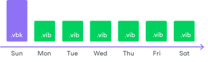
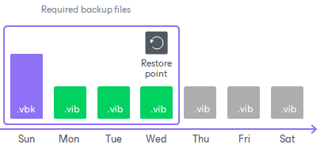

# Backup Chain

Every backup job session produces a new backup file in the target location. Backup files make up a backup chain. The backup chain can contain files of two types: full backups and incremental backups.

* During the first backup job session, Veeam Agent performs full backup. It copies all data that you have chosen to back up (entire volumes and folders) and stores the resulting full backup file (VBK) in the target location. The full backup takes significant time to complete and produces a large backup file: you have to copy the whole amount of data.
* During subsequent backup job sessions, Veeam Agent performs incremental backups. It copies only new or changed data relatively to the last backup job session and saves this data as an incremental backup file (VIB) in the target location. Incremental backups typically take less time than full backup: you have to copy only changes, not the whole amount of data.

After several backup cycles, you have a chain of backup files in the target location: the first full backup file and subsequent incremental backup files. Every backup file contains a restore point for backed-up data. A restore point is a "snapshot" of your data at a specific point in time. You can use restore points to roll back your data to the necessary state.

To recover data to a specific restore point, you need a chain of backup files: a full backup file plus a set of incremental backup files following this full backup file. If some file from the backup chain is missing, you will not be able to roll back to the necessary state. For this reason, we recommend that you do not delete separate backup files manually. To learn more, see [Deleting Backups](backup_delete.md).

In This Section

* [Types of Backup Files](backup_files.md)
* [Short-Term Retention Policy](retention.md)
* [Long-Term Retention Policy](gfs_retention.md)
* [Active Full Backup](active_full_backup.md)
* [Synthetic Full Backup](synthetic_full_backup.md)
* [Health Check for Backup Files](backup_health_check.md)
* [Compact of Full Backup File](backup_compact_file.md)

