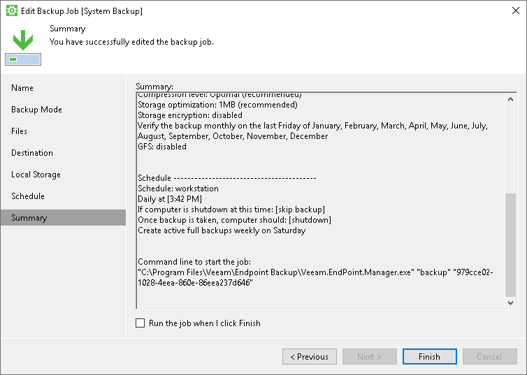

# Performing Backup with Command Line Interface

In addition to running scheduled backup jobs and performing ad-hoc backups from the Veeam Agent tray agent or control panel, you can create backups with the command line interface. For example, you can use commands for running a backup job in custom scripts to set up more detailed backup schedule than the daily schedule configured with the control panel.

You can run a backup job from the command line interface to create the following types of backups:

* Full or incremental backup (regular restore point in the backup chain)
* Active full backup
* Standalone full backup
* Backup to another location

|  |
| --- |
|  IMPORTANT |
| If you create backups with the command line interface, Veeam Agent will ignore the following network connection restrictions:   * Disabled backup over metered connections * Disabled backup over VPN connections * Backup over selected wireless networks   To learn more about network usage settings, see [Restricting Network Connections Usage](settings_network.md). |

Before you create a backup from the command line interface, check the following prerequisites:

* The backup job must be configured.
* You cannot run a backup job from the command line interface if a backup task for this job is currently running. This includes a scheduled backup, standalone full backup or ad-hoc incremental backup.

If more than one backup job is configured, you can run multiple backup jobs at the same time.

* To create a standalone full backup or backup to another location, you must run the command line interface with administrative privileges.
* If more than one backup job is configured, you must specify the job ID in the "00000000-0000-0000-0000-000000000000" format. You can find the job ID at the Summary step of the backup job wizard.

Creating Backups

To perform backup, use a command with the following syntax:

* If one backup job is configured:

|  |
| --- |
| "C:\Program Files\Veeam\Endpoint Backup\Veeam.EndPoint.Manager.exe" /backup |

* If more than one backup job is configured:

|  |
| --- |
| "C:\Program Files\Veeam\Endpoint Backup\Veeam.EndPoint.Manager.exe" /backup "<ID>" |

where <ID> — unique job ID generated by Veeam Agent for Microsoft Windows.

Creating Active Full Backups

To create an active full backup, use a command with the following syntax:

* If one backup job is configured:

|  |
| --- |
| "C:\Program Files\Veeam\Endpoint Backup\Veeam.EndPoint.Manager.exe" /activefull |

* If more than one backup job is configured:

|  |
| --- |
| "C:\Program Files\Veeam\Endpoint Backup\Veeam.EndPoint.Manager.exe" /activefull "<ID>" |

where <ID> — unique job ID generated by Veeam Agent for Microsoft Windows.

Creating Standalone Full Backups

To create a standalone full backup, use a command with the following syntax:

* If one backup job is configured:

|  |
| --- |
| "C:\Program Files\Veeam\Endpoint Backup\Veeam.EndPoint.Manager.exe" /standalone |

* If more than one backup job is configured:

|  |
| --- |
| "C:\Program Files\Veeam\Endpoint Backup\Veeam.EndPoint.Manager.exe" /standalone "<ID>" |

where <ID> — unique job ID generated by Veeam Agent for Microsoft Windows.

Performing Backup to Another Location

To create a standalone full backup to a different location than a location that is specified in the backup job settings, use a command with the following syntax:

* If one backup job is configured:

|  |
| --- |
| "C:\Program Files\Veeam\Endpoint Backup\Veeam.EndPoint.Manager.exe" /standalone <location> |

* If more than one backup job is configured:

|  |
| --- |
| "C:\Program Files\Veeam\Endpoint Backup\Veeam.EndPoint.Manager.exe" /standalone <location> "<ID>" |

where:

* <location> — path to a folder in which the backup should be created.
* <ID> — unique job ID generated by Veeam Agent for Microsoft Windows.

|  |
| --- |
|  IMPORTANT |
| You can specify a network shared folder as a target location for standalone full backup only if read and write permissions on this folder are granted to Everyone or to the LocalSystem account of the Veeam Agent computer. You cannot specify credentials to access the network shared folder in the command. |

Monitoring Backup Job Status

When you start a backup job from the command line interface, it runs automatically in the background. You can view information about the backup job session or the created restore point in the control panel. To learn more, see [Viewing Statistics in Control Panel](reporting_control_panel.md).

You can also use the last exit code to verify if the backup job has completed successfully. To check the last exit code, use the %ERRORLEVEL% variable in cmd.exe.

Veeam Agent for Microsoft Windows can provide the following exit codes:

* 0 — backup successfully created
* -1 — backup job failed to start or completed with error
* 5 — backup job is currently running and cannot be started from the command line interface

Related Topics

* [Scheduled Backup Job](scheduled_backup.md)
* [Ad-Hoc Backup](adhoc_backup.md)
* [Backup Chain](backup_chain.md)

