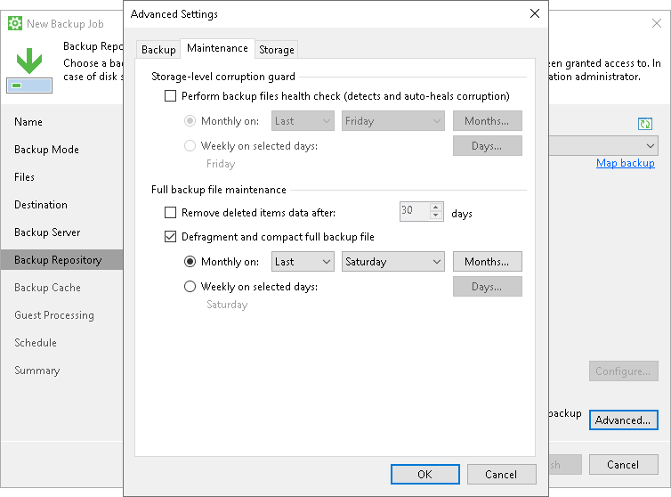

# Compact of Full Backup File

If you do not create periodic full backups, the backup job constantly transforms the full backup file in the backup chain to meet retention policy settings. The transformation process, however, has a side effect. In the long run, the full backup file grows large and gets badly fragmented. The file data occurs to be written to non-contiguous clusters on disk, and operations of reading and writing data from and to the backup file slow down.

To resolve the fragmentation problem, you can instruct Veeam Agent for Microsoft Windows to compact the full backup file periodically. During the file compact operation, Veeam Agent creates a new empty file and copies to this file data blocks from the original full backup file. As a result, the full backup file gets defragmented and the speed of reading and writing from and to the file increases.

|  |
| --- |
| NOTE |
| Keep in mind that some data blocks belonging to data deleted from the backup source may not be deleted during the compact operation. As a result, the difference in size between the original and the new full backup files may not be equal to the size of the excluded data blocks. In this case, you can manually create an active full backup and reset the backup chain. To learn more about the active full backup, see [Active Full Backup](active_full_backup.md). |

To compact the full backup file periodically, you must enable the Defragment and compact full backup file option in the backup job settings and define the compact operation schedule. By default, the compact operation is performed on the last Saturday of every month. You can change the compact operation schedule and instruct Veeam Agent for Microsoft Windows to perform it weekly or monthly on specific days.

Limitations for Full Backup File Compact

The full backup file compact has the following limitations:

* The Defragment and compact full backup file option can be enabled only for backup jobs for which active full and synthetic full backups are not scheduled.
* The Defragment and compact full backup file option is not available for backup jobs targeted at object storage.

* The compact full backup file operation is not performed during backup job sessions that produce active full backups. If the backup job starts again on the same day when the active full backup was created, Veeam Agent for Microsoft Windows does not perform the compact full backup operation. This limitation helps reduce the number of backup operations — Veeam Agent considers that the full backup is recent and does not need to be rebuilt.

If such situation occurs, Veeam Agent for Microsoft Windows triggers the full backup file compact operation during the next backup job session that produces an incremental backup file on another day.

* The target location must have enough space to store a file of the full backup size. During the compact process, Veeam Agent for Microsoft Windows creates auxiliary files that exist in the target location until the end of the compact operation.

* If you change the block size in backup job settings, Veeam Agent for Microsoft Windows does not change the block size in the compacted backup file till the next full backup. However, if you change compression settings in backup job settings, during the next compact file operation Veeam Agent for Microsoft Windows changes the compression level for the compacted backup file.

* The file compact operation is not performed during a backup job session that creates a restore point in the backup cache.

* The file compact operation is not performed during the backup cache synchronization process.

Removal of Deleted Drives Data

During the compact operation, Veeam Agent for Microsoft Windows does not copy all data blocks from the VBK file to the newly created file. It copies only data blocks of Veeam Agent computer drives whose information is stored in the Veeam Agent for Microsoft Windows database. If a drive was removed from the Veeam Agent computer, its data is not copied to the new full backup file. This approach helps reduce the size of the full backup file and remove unnecessary data from it.

Related Topics

[Creating Backup Jobs](backup_job_create.md)

