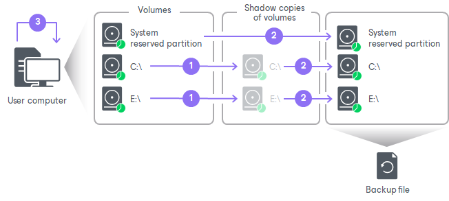

# How Backup Works

During backup, Veeam Agent for Microsoft Windows performs the following operations:

1. Veeam Agent requests the creation of a Microsoft VSS snapshot of the volume whose data you want to back up. The VSS snapshot helps make sure that the data on the volume is consistent and does not change at the moment of backup.

* In the Free and Workstation product editions, the VSS snapshot type depends on the OS of the Veeam Agent computer. On Microsoft Windows Client OSes, Veeam Agent requests a copy-only VSS snapshot. On Microsoft Windows Server OSes, Veeam Agent requests a full VSS snapshot.
* In the Server product edition, the VSS snapshot type depends on the specified application-aware processing settings. To learn more, see [Application-Aware Processing](application_aware_processing.md).

Veeam Agent does not request a VSS snapshot for the EFI system partition on GPT disks, because its data does not change during backup. For the System Reserved and other system partitions, VSS snapshot can be created if there is enough free disk space on the partition.

|  |
| --- |
|  NOTE |
| Consider the following:   * By default, Microsoft Windows does not include offline Outlook Data Files (.ost) into a VSS snapshot. As a result, these files are not included into Veeam Agent backups, too. * If the Microsoft VSS technology fails to create a VSS snapshot for some reason, Veeam Agent for Microsoft Windows resends the request up to 3 times. |

1. Veeam Agent reads data from the created VSS snapshot, compresses it and copies it to the target location.

* For volume-level backup, Veeam Agent copies data blocks of the whole volume.
* For file-level backup, Veeam Agent creates a volume inside the backup file in the target location. The content of the volume in the backup file is synchronized with the volume on the source: Veeam Agent for Microsoft Windows copies only those data that you have selected to back up.

During incremental backup, Veeam Agent uses Changed Block Tracking (CBT) to retrieve only those data blocks that have changed since the previous backup session. To learn more, see [Change Block Tracking](backup_cbt.md).

In the target location, Veeam Agent stores copied data to the backup file.

1. If an application on the computer uses transaction logs to maintain the database consistency, Veeam Agent can truncate transaction logs upon successful backup.

* In the Free and Workstation product editions, Veeam Agent truncates transaction logs depending on the OS of the Veeam Agent computer. On Microsoft Windows Client OSes, Veeam Agent does not truncate logs. On Microsoft Windows Server OSes, Veeam Agent always truncates logs.
* In the Server product edition, Veeam Agent truncates logs depending on the specified application-aware processing settings. To learn more, see [Application-Aware Processing](application_aware_processing.md).

|  |
| --- |
|  IMPORTANT |
| The Veeam Agent Service runs under the LocalSystem account. On Microsoft SQL Server 2012, this account does not have necessary permissions to truncate transaction logs. If you want Veeam Agent to automatically truncate transaction logs, you need to manually add the LocalSystem account to a group that has the SQL Server System Administrator rights. |

