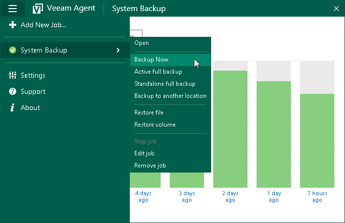

# Creating Incremental Backups

You can create an ad-hoc incremental backup of your data in addition to the scheduled backup. Ad-hoc incremental backup may be necessary if you want to capture your data at a specific point in time, for example, before you install new software on your computer. Ad-hoc incremental backup lets you produce an additional restore point in the backup chain at any time and does not require you to reconfigure the scheduling settings in the backup job.

Before you perform ad-hoc incremental backup, check the following prerequisites:

* The backup job that you want to use to perform ad-hoc incremental backup must be configured and successfully run at least once.

* You cannot perform ad-hoc incremental backup if a backup task of any type is currently running. These include a scheduled backup, standalone full backup, active full backup or ad-hoc incremental backup.

To perform ad-hoc incremental backup:

1. Double-click the Veeam Agent for Microsoft Windows icon in the system tray or right-click it and select Control Panel.
2. Do either of the following:

* If the Veeam Agent control panel currently displays statistics of the job that you want to use to perform ad-hoc incremental backup, in the job statistics window, click Backup Now.
* If you want to perform ad-hoc incremental backup using another backup job configured in Veeam Agent, in the main menu, hover over the name of the necessary job and select Backup now.

If only one job is configured in Veeam Agent for Microsoft Windows, you can also start the ad-hoc incremental backup task from the system tray menu:

1. Right-click the Veeam Agent for Microsoft Windows icon in the system tray.
2. Select Backup > Backup now.

|  |
| --- |
|  NOTE |
| The Backup option is not available in the system tray menu if multiple backup jobs are configured in Veeam Agent for Microsoft Windows. |

Veeam Agent for Microsoft Windows will perform incremental backup using settings of the scheduled backup job and add a new restore point to the backup chain in the target location.

Related Topics

[Ad-Hoc Incremental Backup](adhoc_backup_incremental.md)

