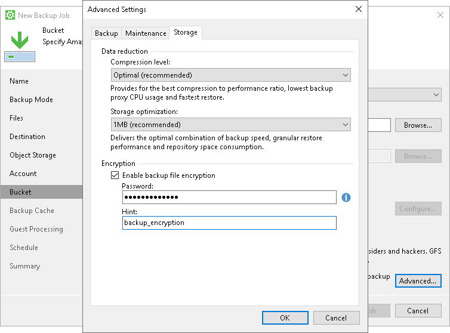

# Storage Settings

To specify storage settings for the backup job:

1. Click Advanced at one of the following steps of the wizard:

* [Local Storage](backup_job_drive.md) — if you have selected the Local storage option at the [Destination](backup_job_target.md) step of the wizard.
* Bucket/Container — if you have selected the Object storage option at the [Destination](backup_job_target.md) step of the wizard.
* [Shared Folder](backup_job_share.md) — if you have selected the Shared folder option at the [Destination](backup_job_target.md) step of the wizard.
* [Backup Repository](backup_job_vbr.md#repo) — if you have selected the Veeam backup repository option at the [Destination](backup_job_target.md) step of the wizard.
* [Backup Resources](backup_job_sp_settings.md#repo) — if you have selected the Veeam Cloud Connect repository option at the [Destination](backup_job_target.md) step of the wizard.

1. Click the Storage tab.
2. From the Compression level list, select a compression level for the backup: None, Dedupe-friendly, Optimal, High or Extreme.
3. In the Storage optimization section, select what size of data blocks you plan to use: 4 MB, 1 MB, 512 KB, 256 KB. Veeam Agent for Microsoft Windows will use data blocks of the chosen size to optimize the size of backup files and job performance.
4. If you want to encrypt the content of backup files, in the Encryption section, specify encryption settings for the backup job:

1. Select the Enable backup file encryption check box.
2. In the Password field, type a password that you want to use for encryption.
3. In the Hint field, type a hint for the password. In case you lose the password, the specified hint will help you to remember the lost password.

|  |
| --- |
| NOTE |
| Consider the following:   * You cannot specify encryption options for the backup job if you have chosen to save backup files in a Veeam backup repository. Encryption of Veeam Agent backups stored in the backup repository are managed per repository by a backup administrator working with Veeam Backup & Replication. To learn more, see the [Encrypting Standalone Application Backups in Backup Repositories](https://helpcenter.veeam.com/docs/vbr/userguide/encrypting_backups.html?ver=13) section in the Veeam Backup & Replication User Guide.  * If you lose a password that was specified for encryption, you can change the password in the encryption settings. After the backup job creates a new restore point encrypted with the new password, you will be able to use this password to restore data from all restore points in the backup chain, including those restore points that were encrypted with an old password.  * If you enable encryption for the existing backup job that has already created one or more restore points, during the next job session, Veeam Agent for Microsoft Windows will create active full backup. The created full backup file and subsequent incremental backup files in the backup chain will be encrypted with the specified password. * Encryption is not retroactive. If you enable encryption for the existing backup job, Veeam Agent for Microsoft Windows does not encrypt the previous backup chain created with this job. |

