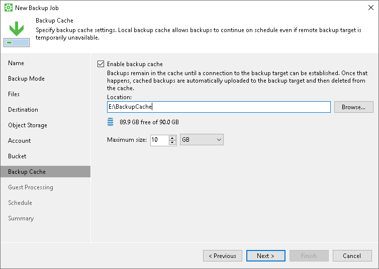

# Step 9. Specify Backup Cache Settings

The Backup Cache step of the wizard is available if you have chosen to save backup files in a remote storage: in object storage, in a network shared folder, in a Veeam backup repository or in a Veeam Cloud Connect repository.

Specify backup cache settings:

1. Select the Enable backup cache check box.
2. In the Location field, specify a path to the folder on your computer in which backup files must be stored.
3. In the Maximum size field, specify the size for the backup cache.

When defining the size of the backup cache, assume the following:

* Each full backup file may consume about 50% of the backed-up data size.
* Each incremental backup file may consume about 10% of the backed-up data size.

|  |
| --- |
|  TIP |
| For the backup cache, you can use a dedicated removable storage device, for example, a USB key or an SD card. In this case, the backup cache will not consume disk space on the local drive of the Veeam Agent computer. |

