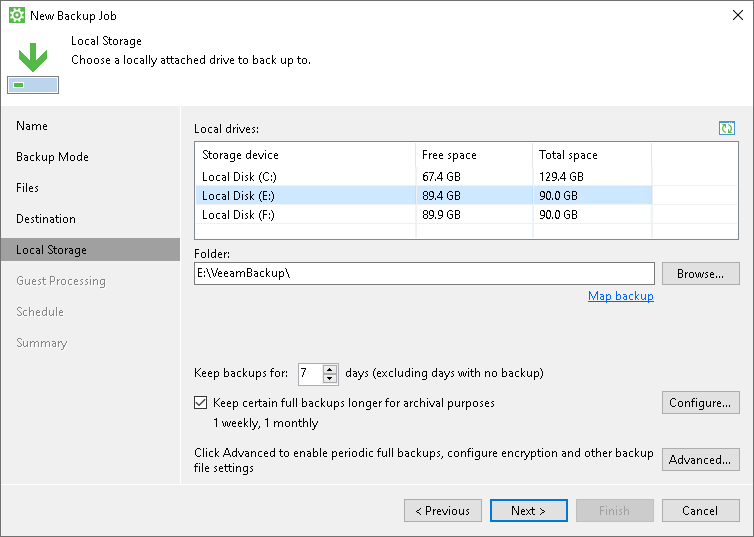
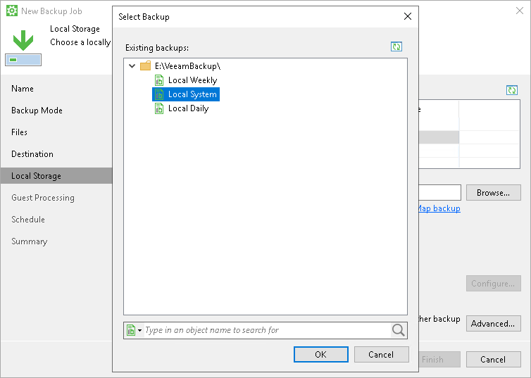

# Local Storage Settings

The Local Storage step of the wizard is available if you have chosen to save the backup on a local drive of your computer.

Specify local storage settings:

1. In the Local drives list, select a drive where you want to store the backup.
2. In the Folder field, specify a path to the folder where backup files must be saved. By default, Veeam Agent saves files in the VeeamBackup folder.
3. If you want to map the job to a specific backup that was previously created on the same Veeam Agent computer, click the Map Backup link and select the backup.

To learn more, see [Mapping Backup Job](#map).

1. In the Keep backups for <N> days (excluding days with no backup) field, specify the number of days for which you want to store backup files in the target location. By default, Veeam Agent keeps backup files for 7 days. After this period is over, Veeam Agent will remove the earliest restore points from the backup chain. To learn more, see [General Short-term Retention Policy](retention_days.md).
2. [For Workstation and Server product editions] To use the GFS (Grandfather-Father-Son) retention scheme, select the Keep certain full backups longer for archival purposes check box and click Configure. In the Configure GFS window, specify how weekly, monthly and yearly full backups must be retained. To learn more, see the [Long-Term Retention Policy](https://helpcenter.veeam.com/docs/vbr/userguide/backup_copy_gfs.html?ver=13) section in the Veeam Backup & Replication User Guide.

1. Click Advanced to specify advanced settings for the backup job. To learn more, see [Specify Advanced Backup Settings](backup_job_advanced.md).

|  |
| --- |
|  IMPORTANT |
| USB storage devices formatted as FAT32 do not allow storing files larger than 4 GB in size. For this reason, we recommend that you do not use such USB storage devices as a backup target. |

Mapping Backup Job

If you have selected to map the job to the already created backup that is stored on a local drive, perform the following steps:

1. In the Folder field, specify the same path as was specified in the Folder field for the job that was used to create the backup.
2. Click Map backup and select the desired backup. To find the backup, you can use the search field at the bottom of the Select Backup window.

Keep in mind that Veeam Agent displays backups stored in the folder that is specified in the Folder field and its first-level subfolders.

1. If you map the job to an encrypted backup, and encryption keys are not available in the Veeam Agent database, you must provide the password specified for encryption. In the displayed window, enter the password and click OK.

