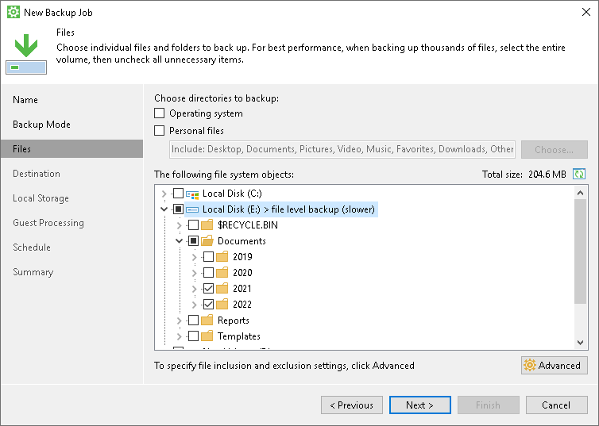
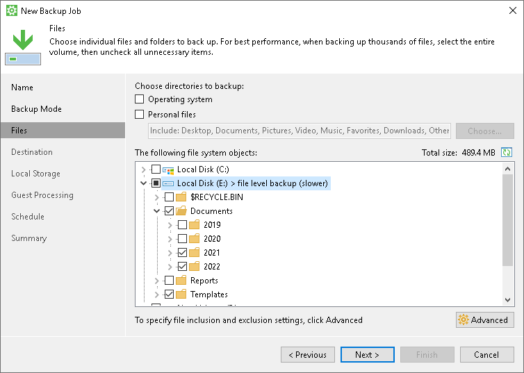
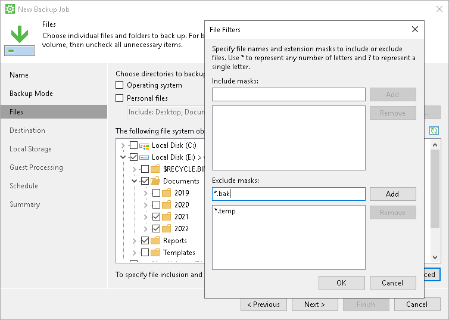
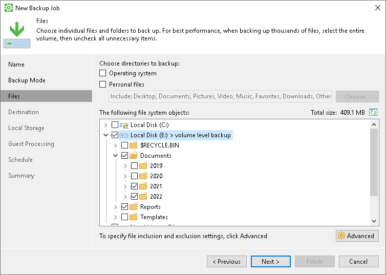

# Selecting Folders to Back Up

The Files step of the wizard is available if you have chosen to create a file-level backup.

In the file-level backup mode, you can create two types of backups:

* File-level backup that includes individual folders on your computer.
* Hybrid backup that contains individual folders and specific volumes of your computer.

At this step of the wizard, you must specify the backup scope — define what folders with files or entire volumes you want to include in the backup.

To specify the backup scope, select check boxes next to necessary objects. You can include the following data in the backup:

* Operating system data — system data required to boot the OS installed on your computer. With this option enabled, Veeam Agent for Microsoft Windows will include in the backup scope Microsoft Windows system partition and boot partition of your computer. For GPT disks on Microsoft Windows Server from version 2012 R2 to version 2025, Veeam Agent for Microsoft Windows will additionally back up the recovery partition. To learn more, see [System State Data Backup](system_state_backup.md).
* Personal files — data related to user profiles. With this option enabled, Veeam Agent for Microsoft Windows will include in the backup scope settings and data related to Veeam Agent computer user profiles.

You can specify what personal data to include in the backup and choose whether to exclude roaming profiles from the backup. To do this, click Choose next to the Personal files field and select the necessary options in the Personal Folders window. To learn more, see [Personal Data Backup](personal_files_backup.md).

* Individual folders. To learn more, see [Selecting Folders](#select_fldr).
* Individual computer volumes and mount points (located on local drives or external USB drives). To learn more, see [Selecting Volumes](#select_vlm).

|  |
| --- |
|  IMPORTANT |
| Consider the following:   * Veeam Agent for Microsoft Windows does not include the following Microsoft Windows objects in the backup: temporary files folder, Recycle Bin, Microsoft Windows pagefile, hibernate file and VSS snapshot files from the System Volume Information folder.   Also, Veeam Agent does not include in the file-level backup files encrypted with Windows Encrypting File System (EFS).   * If you have a file-level backup job configured and need to extend the volume where backed-up files reside, we strongly recommend to create an active full backup after the volume is extended. Otherwise, Veeam Agent may skip files during the job run even if these files are added to the backup scope. To learn more, see [Creating Active Full Backups](backup_active_full.md). |

Selecting Folders

To include a folder in the file-level backup:

1. In the The following file system objects list, browse to the folder that you want to back up and select the check box next to this folder.

After you select a folder, Veeam Agent will display the file level backup mark next to the volume that contains this folder.

1. If you want to include or exclude files of a specific type in/from the backup, click Advanced. To learn more, see [Configuring Filters](#filters).

Alternatively, if you want to quickly include a large number of folders in the backup, you can select folders in the following way:

1. Select the check box next to the volume that contains folders you want to back up.

Veeam Agent will display the volume level backup mark next to the selected volume.

1. Expand the volume and clear the check boxes next to one or more folders that you want to exclude from the backup.
2. Select the check box next to the volume once again.

Veeam Agent will display the file level backup mark next to the volume. You can include or exclude files that reside on this volume in/from the backup. To learn more, see [Configuring Filters](#filters).

Configuring Filters

To include or exclude files of a specific type in/from the file-level backup, you can configure filters.

|  |
| --- |
|  NOTE |
| Veeam Agent for Microsoft Windows applies filters to files in specific folders that you include in the backup. Filters are not applied to computer volumes and mount points selected for backup. If you plan to create a hybrid backup that will contain volumes, mount points, and folders, filters will be applied to files in folders only. |

To configure a filter:

1. At the Files step of the wizard, click Advanced.
2. Specify what files you want to back up:

* In the Include masks field, specify file names and masks for file types that you want to back up, for example, MyMovie.avi, \*filename\*, \*.docx, \*.mp3. Veeam Agent will create a backup only for selected files. Other files will not be backed up.
* In the Exclude masks field, specify file names and masks for file types that you do not want to back up, for example, OldPhotos.rar, \*.temp, \*.tmp, \*.back. Veeam Agent will back up all files except files of the specified type.

1. Click Add.
2. Repeat steps 2–3 for each mask that you want to add.

You can use a combination of include and exclude masks. Keep in mind that exclude masks have a higher priority than include masks. For example, you can specify masks in the following way:

* Include mask: \*.avi

* Exclude mask: \*movie\*

Veeam Agent will include in the backup all files of the AVI format that do not contain movie in their names.

|  |
| --- |
|  TIP |
| For more examples of configuring file filters, see [Use Filters to Define File-Level Backup Scope](howto_select_backup_items.md). |

Selecting Volumes

You can include individual volumes in the backup at the Files step of the wizard. This may be useful if you want to have a volume-level backup of the volume with specific folders excluded. Volume-level backup also offers better performance in case you back up a complex folder structure with many files.

You can also include individual mount points in the backup at the Files step of the wizard, but you cannot exclude folders from mount points.

To include a volume or a mount point in the file-level backup:

1. In the The following file system objects list, select the check box next to the item that you want to back up.
2. If you want to exclude a folder on the selected volume from the backup, expand the volume and clear the check box next to the necessary folder.

|  |
| --- |
| IMPORTANT |
| Consider the following:   * If you select a volume for backup, you cannot use filters to include or exclude files of a specific type in/from the backup. You can only exclude specific folders that reside on the volume. If you want to include or exclude files, you must select individual folders for backup. To learn more, see [Selecting Folders](#select_fldr). * If you select a deduplicated volume for backup, make sure that you do not exclude any folders from the backup. Otherwise, the backup files may get corrupted. |

