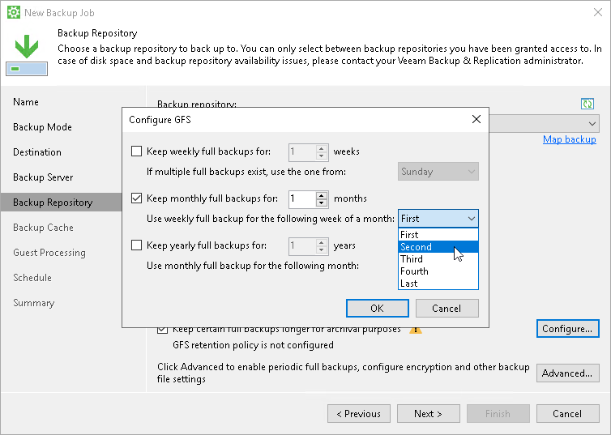

# Step 7. Specify GFS Retention Policy

This step of the wizard is available if you use the Workstation or Server edition of Veeam Agent for Microsoft Windows.

|  |
| --- |
| NOTE |
| If you want to store your backups in object storage, and you do not configure Veeam Agent to perform active full backups periodically, Veeam Agent still requires a full backup to assign a GFS flag to a full restore point. In this case, Veeam Agent creates a full backup based on the last incremental backup. If some data blocks required to create the full backup reside in object storage, the full backup contains links that point at such data blocks. Veeam Agent does not retrieve actual data blocks from the object storage to avoid extra costs. |

To configure GFS retention policy settings for the backup job:

1. Click the Configure button at one of the following steps of the wizard:

* [Local Storage](backup_job_drive.md) — if you have selected the Local storage option at the [Destination](backup_job_target.md) step of the wizard.
* [Shared Folder](backup_job_share.md) — if you have selected the Shared folder option at the [Destination](backup_job_target.md) step of the wizard.
* Bucket/Container — if you have selected the Object storage option at the [Destination](backup_job_target.md) step of the wizard.
* [Backup Repository](backup_job_vbr.md#repo) — if you have selected the Veeam backup repository option at the [Destination](backup_job_target.md) step of the wizard.
* [Backup Resources](backup_job_sp_settings.md#repo) — if you have selected the Veeam Cloud Connect repository option at the [Destination](backup_job_target.md) step of the wizard.

1. In the Configure GFS window, do the following:

1. If you want to create weekly restore points for archival purposes, select the Keep weekly full backups for check box. Then specify the number of weeks during which you want to prevent restore points from being modified and deleted.

* In the If multiple full backups exist, use the one from list, select a week day when Veeam Agent must assign the weekly GFS flag to a full restore point.
* [For object storage target if active full backup schedule is not enabled] In the Create weekly full on this day list, select a week day when Veeam Agent must create a full backup and assign the weekly GFS flag to a full restore point.

1. If you want to create monthly restore points for archival purposes, select the Keep monthly full backups for check box. Then specify the number of months during which you want to prevent restore points from being modified and deleted.

In the Use weekly full backup for the following week of a month list, select a week when Veeam Agent must assign the monthly GFS flag to a full restore point. A week equals to 7 calendar days; for example, the first week of May is days 1–7, and the last week of May is days 25–31.

1. If you want to create yearly restore points for archival purposes, select the Keep yearly full backups for check box. Then specify the number of years during which you want to prevent restore points from being modified and deleted.

In the Use monthly full backup for the following month list, select a month when Veeam Agent must assign the yearly GFS flag to a full restore point.

|  |
| --- |
| NOTE |
| If you select to assign multiple types of GFS flags, the flags begin to depend on each other. For more information on this dependency, see the [Assignment of GFS Flags](https://helpcenter.veeam.com/docs/vbr/userguide/gfs_how_flags_assigned.html?ver=13) section in the Veeam Backup & Replication User Guide. |

Related Topic

[Long-Term Retention Policy (GFS)](gfs_retention.md).

