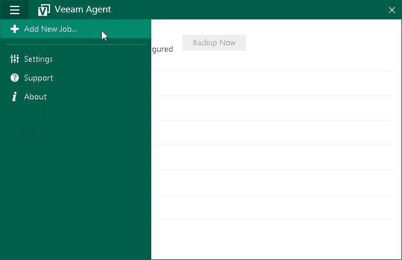

# Step 1. Launch New Backup Job Wizard

To launch the New Backup Job wizard, do either of the following:

* [If no backup jobs are configured] Double-click the Veeam Agent for Microsoft Windows icon in the system tray.
* Right-click the Veeam Agent for Microsoft Windows icon in the system tray and select Backup > Configure backup.

|  |
| --- |
| NOTE |
| The Backup option is not available in the system tray menu if multiple backup jobs are configured in Veeam Agent for Microsoft Windows. |

* Right-click the Veeam Agent for Microsoft Windows icon in the system tray and select Control Panel. Then, from the main menu, select Add New Job.
* From the Microsoft Windows Start menu, select All Programs > Veeam > Tools > Configure Backup or use the Microsoft Windows search to find the Configure Backup option on your computer.

