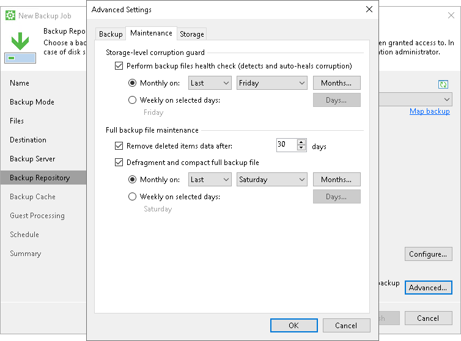

# Maintenance Settings

To specify maintenance settings for the backup chain created with the backup job:

1. Click Advanced at one of the following steps of the wizard:

* [Local Storage](backup_job_drive.md) — if you have selected the Local storage option at the [Destination](backup_job_target.md) step of the wizard.
* Bucket/Container — if you have selected the Object storage option at the [Destination](backup_job_target.md) step of the wizard.
* [Shared Folder](backup_job_share.md) — if you have selected the Shared folder option at the [Destination](backup_job_target.md) step of the wizard.
* [Backup Repository](backup_job_vbr.md#repo) — if you have selected the Veeam backup repository option at the [Destination](backup_job_target.md) step of the wizard.
* [Backup Resources](backup_job_sp_settings.md#repo) — if you have selected the Veeam Cloud Connect repository option at the [Destination](backup_job_target.md) step of the wizard.

1. Click the Maintenance tab.
2. To periodically perform a health check for the latest restore point in the backup chain, enable the Perform backup files health check option in the Storage-level corruption guard section and specify the health check schedule. For more information, see [Health Check for Backup Files](backup_health_check.md).
3. [For object storage target] Veeam Agent offers a special health check mechanism for object storage targets. To run the health check for object storage, enable the Perform backup files health check option in the Storage-level corruption guard section and specify the health check schedule. For more information about the health check for object storage, see [Enabling Health Check for Object Storage Target](#os_health_check).
4. [For Veeam backup repository and cloud repository targets] Select the Remove deleted items data after check box and specify the number of days for which you want to keep the backup created with the backup job in the target location. If Veeam Agent for Microsoft Windows does not create new restore points for the backup, the backup will remain in the target location for the period that you have specified. When this period is over, the backup will be removed from the target location.

By default, the retention period for outdated backups is 30 days. Do not set this retention period to 1 day or a similar short interval. In the opposite case, the backup job may work not as expected and remove data that you still require. For more information, see [Retention Policy for Outdated Backups](retention_deleted_items.md).

|  |
| --- |
|  NOTE |
| The Remove deleted items data after option is available only if you have selected the Veeam backup repository or Veeam Cloud Connect repository option at the [Destination](backup_job_target.md) step of the wizard. |

1. To periodically compact a full backup, select the Defragment and compact full backup file check box and specify the schedule for the compact operation.

During the compact operation, Veeam Agent for Microsoft Windows creates a new empty file and copies to this file data blocks from the full backup file. As a result, the full backup file gets defragmented, and the speed of reading from and writing to the backup file increases.

If the full backup file contains data blocks for deleted drives, Veeam Agent for Microsoft Windows will remove these data blocks. For more information, see [Compact of Full Backup File](backup_compact_file.md).

|  |
| --- |
| NOTE |
| The Defragment and compact full backup file option is not available for backup jobs targeted at object storage. |

Enabling Health Check for Object Storage Target

To periodically perform a health check for backups that reside in object storage, enable the Perform backup files health check option in the Storage-level corruption guard section and specify the health check schedule.

Veeam Agent offers a special health check mechanism for object storage targets as default. Unlike the standard health check, the health check for object storage verifies metadata for the whole backup, not just the latest restore point, and does not read data from data blocks. For more information, see [Health Check for Object Storage](health_check_object_storage.md).

If necessary, you can switch from the health check for object storage to the standard health check. To do so, select the Verify content of each object in backup check box in the backup job settings. Keep in mind that enabling this setting may result in additional charges from your object storage provider. For information on how the standard health check works, see [Standard Health Check](health_check_standard.md).

Related Topics

* [Health Check for Backup Files](backup_health_check.md)
* [Standard Health Check](health_check_standard.md)
* [Health Check for Object Storage](health_check_object_storage.md)
* [Retention Policy for Outdated Backups](retention_deleted_items.md)
* [Compact of Full Backup File](backup_compact_file.md)

