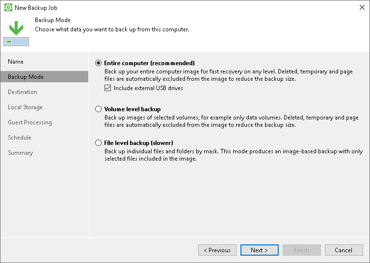

# Step 3. Select Backup Mode

At the Backup Mode step of the wizard, select the mode in which you want to create a backup:

1. In the Backup mode section, select the backup mode. You can select one of the following options:

* Entire computer — select this option if you want to create a backup of the entire computer image. When you restore data from such backup, you will be able to recover the entire computer image as well as data on specific computer volumes: files, folders, application data and so on. With this option selected, you will pass to the [Destination](backup_job_target.md) step of the wizard.
* Volume level backup — select this option if you want to create a backup of specific computer volumes, for example, all volumes except the system one. When you restore data from such backup, you will be able to recover data on these volumes only: files, folders, application data and so on. With this option selected, you will pass to the [Volumes](backup_job_volumes.md) step of the wizard.
* File level backup — select this option if you want to create a backup of individual folders on your computer. When you backup data in this mode, you can configure additional rules to include/exclude files of the specific type in/from your backup. When you restore data from such backup, you will be able to recover backed-up files and folders. With this option selected, you will pass to the [Files](backup_job_folders.md) step of the wizard.

1. [For entire computer backup] If you want to include in the backup one or more external USB drives, select the Include external USB drives check box. With this option selected, Veeam Agent for Microsoft Windows will include in the backup all supported external drives that are connected to the Veeam Agent computer at the time when the backup job starts. Veeam Agent for Microsoft Windows supports backup of external drives that support Microsoft VSS: HDD, SSD, and so on. USB flash drives (USB sticks) are not supported. To learn more, see [Backup of External Drives](backup_usb.md).

|  |
| --- |
| NOTE |
| Consider the following:   * Veeam Agent for Microsoft Windows cannot back up hidden non-system volumes. * File-level backup is typically slower and requires more network traffic than volume-level backup. Depending on the performance capabilities of your computer and backup environment, the difference between file-level and volume-level backup job performance may increase significantly. If you plan to back up all folders with files on a specific volume or back up large amount of data, we recommend that you configure volume-level backup instead of file-level backup. |

