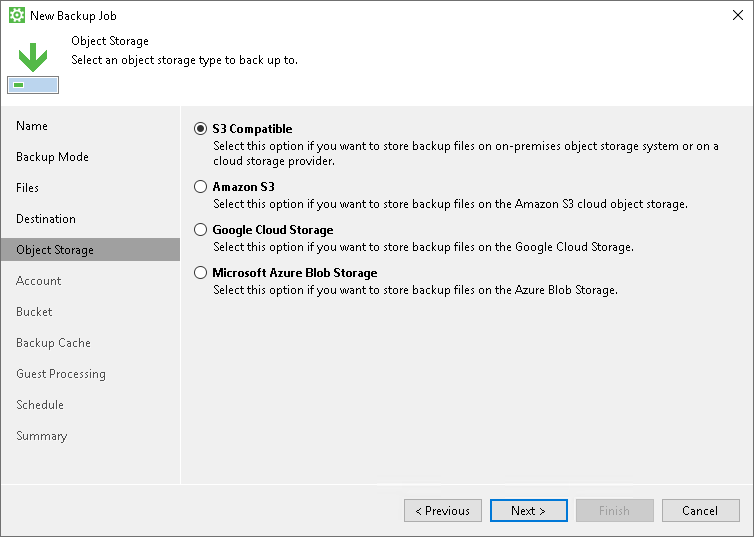

# Object Storage Settings

The Object Storage step of the wizard is available if you have selected the Object storage option at the [Destination](backup_job_target.md) step of the wizard.

At the Object Storage step of the wizard, select the object storage. You can select one of the following options:

* S3 compatible — select this option if you want to create a backup in the S3 compatible storage. With this option selected, you will pass to the [Account](backup_job_object_storage_s3_compatible.md) step of the wizard.

|  |
| --- |
| TIP |
| If you plan to store backups in an IBM or Wasabi cloud storage, use the S3 compatible option. |

* Amazon S3 — select this option if you want to create a backup in the Amazon S3 storage. With this option selected, you will pass to the [Account](backup_job_object_storage_s3.md) step of the wizard.
* Google Cloud Storage — select this option if you want to create a backup in the Google Cloud storage. With this option selected, you will pass to the [Account](backup_job_object_storage_google.md) step of the wizard.
* Microsoft Azure Blob Storage — select this option if you want to create a backup in the Microsoft Azure storage. With this option selected, you will pass to the [Account](backup_job_object_storage_azure.md) step of the wizard.

