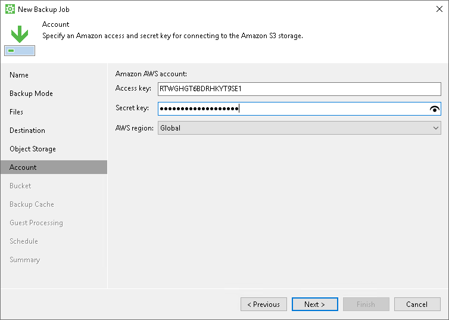
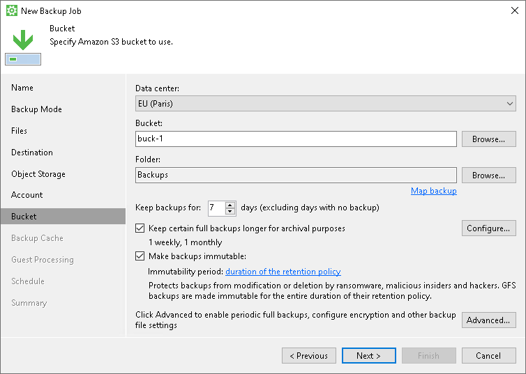
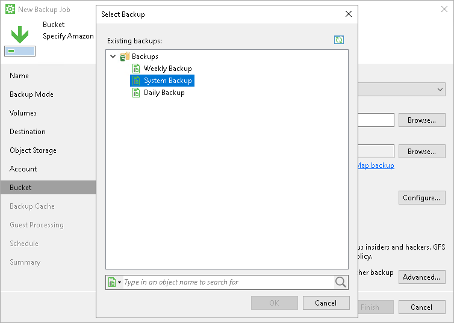

# Amazon S3 Settings

If you have selected to store backup files in the Amazon S3 storage, specify the following settings:

1. [Specify account settings](#storage).
2. [Specify bucket settings](#bucket).

Specifying Account Settings

The Account step of the wizard is available if you have chosen to save backup files in object storage.

To connect to the Amazon S3 storage, specify the following:

1. In the Access key field, enter the access key ID.
2. In the Secret key field, enter the secret access key.

1. From the AWS region drop-down list, select the AWS region based on your regulatory and compliance requirements. By default, Veeam Agent uses the Global region.

Specifying Bucket Settings

The Bucket step of the wizard is available if you have chosen to save backup files in object storage and specified account settings to connect to the storage.

|  |
| --- |
| IMPORTANT |
| You must create the bucket where you want to store your backup data beforehand. When you create a bucket, consider Amazon bucket naming rules. For example, it is not recommended that you use dots (.) in the bucket name. For more information on bucket naming rules, see [this AWS article](https://docs.aws.amazon.com/AmazonS3/latest/userguide/bucketnamingrules.html). |

Specify settings for the bucket in the storage:

1. From the Data center drop-down list, select the geographic region where Veeam Agent will store backups.
2. In the Bucket field, specify a bucket in the storage:

1. Select the Browse option.
2. In the Select Bucket window, do the following:

1. Double-click the region name or click the arrow to the left of the region name to view the list of available buckets.
2. Select the necessary bucket and click OK.

1. In the Folder field, specify a folder in the bucket:

1. Select the Browse option.
2. In the Select Folder window, do the following:

1. Double-click the bucket name or click the arrow to the left of the bucket name to view the list of available folders.
2. Select the necessary folder and click OK.

|  |
| --- |
| NOTE |
| You cannot select a folder that is managed by the Veeam Backup & Replication server. |

If necessary, you can create a new folder. To do this, click the New Folder option in the Select Folder window.

1. If you want to map the job to a specific backup that was previously created on the same Veeam Agent computer, click the Map Backup link and select the backup.

To learn more, see [Mapping Backup Job](#map).

1. In the Keep backups for <N> days (excluding days with no backup) field, specify the number of days for which you want to store backup files in the target location. By default, Veeam Agent keeps backup files for 7 days. After this period is over, Veeam Agent will remove the earliest restore points from the backup chain. To learn more, see [General Short-term Retention Policy](retention_days.md).

To use the GFS (Grandfather-Father-Son) retention scheme, select the Keep certain full backups for archival purposes check box and click Configure. In the Configure GFS window, specify how weekly, monthly and yearly full backups must be retained. To learn more, see [Long-Term Retention Policy](gfs_retention.md).

|  |
| --- |
| IMPORTANT |
| If you use the GFS retention scheme and enable immutability for a backup, the restore points with GFS flags become immutable for the whole GFS retention period. You will not be able to delete such restore points till the end of the GFS retention period. |

1. Select the Make backups immutable check box to enable backup immutability and specify the immutability settings:

* Select For the entire duration of their retention policy if you want the immutability period to depend on the retention policy of a backup job. This option is selected by default when you enable immutability for a backup job.

|  |
| --- |
| IMPORTANT |
| Consider the following:   * If the job retention exceeds the immutability period, the actual retention is counted as the job retention policy + the block generation period. * If the immutability period exceeds the job retention period, the actual retention is counted as the immutability period + the block generation period.   For more information, see [How Immutability Works](backup_immutability_hiw.md). |

* Select For the minimum immutability period only if you want to specify the immutability period explicitly and specify a minimum immutability period in days. By default, Veeam Agent sets the period to 30 days.

In this case,  backup job retention settings are not considered in the calculation of the immutability period.

1. Click Advanced to specify advanced settings for the backup job. To learn more, see [Specify Advanced Backup Settings](backup_job_advanced.md).

After that, Veeam Agent will create a new repository in the cloud storage where you can store backups.

Mapping Backup Job

You can map the job to the already created backup that is stored in the Amazon S3 storage. To map the backup job, perform the following steps:

1. From the Data center drop-down list, select the geographic region where the created backup is stored.
2. In the Bucket field, specify a bucket where the created backup is stored:

1. Select the Browse option.
2. In the Select Bucket window, do the following:

1. Double-click the region name or click the arrow to the left of the region name to view the list of available buckets.
2. Select the necessary bucket and click OK.

1. In the Folder field, specify a folder where the created backup is stored:

1. Select the Browse option.
2. In the Select Folder window, do the following:

1. Double-click the bucket name or click the arrow to the left of the bucket name to view the list of available folders.
2. Select the necessary folder and click OK.

|  |
| --- |
| NOTE |
| You cannot select a folder that is managed by the Veeam Backup & Replication server. |

1. Click Map backup and select the desired backup. To find the backup, you can use the search field at the bottom of the Select Backup window.

Keep in mind that Veeam Agent displays only those backups that were created on the same Veeam Agent computer with the same account used to connect to the Amazon S3 storage.

1. If you map the job to an encrypted backup, and encryption keys are not available in the Veeam Agent database, you must provide the password specified for encryption. In the displayed window, enter the password and click OK.

