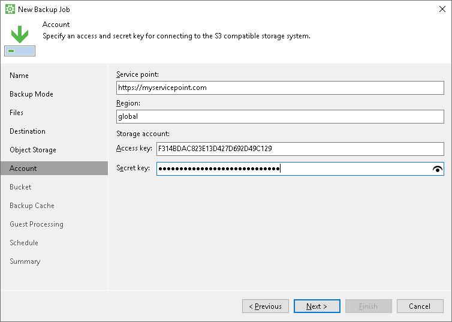
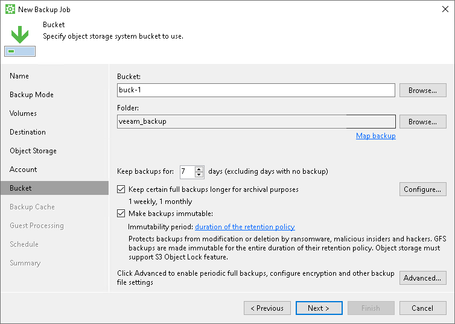
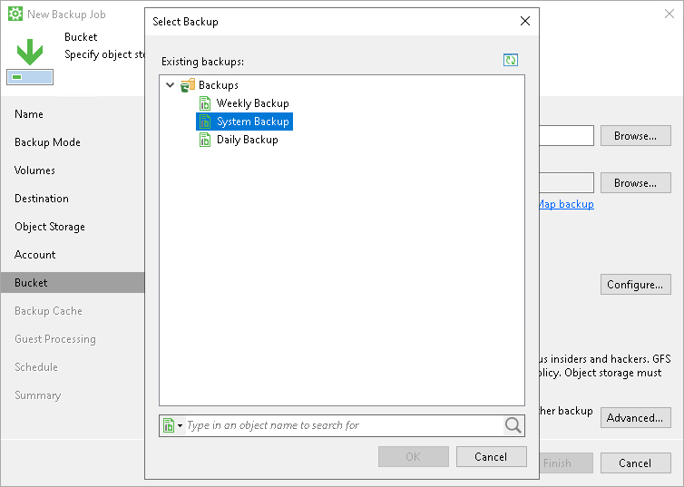

# S3 Compatible Settings

If you have selected to store backup files in the S3 compatible storage, specify the following settings:

1. [Specify account settings](#storage).
2. [Specify bucket settings](#bucket).

Specifying Account Settings

The Account step of the wizard is available if you have chosen to save backup files in object storage.

To connect to the S3 compatible storage, specify the following:

1. In the Service point field, specify the address of your S3 compatible storage.

If you want to connect to the repository using an IPv6 address and port number, use the following format: <IPv6>:<port>, where:

* IPv6 is the ipv6-literal.net notation of the IPv6 address.
* port is the number of the port that Veeam Agent will use to connect to the cloud storage.

For example: https://2001-db8-1--bb8-c0b8-112.ipv6-literal.net:9000

If you want to connect to the repository using AWS PrivateLink for Amazon S3, use the following format: bucket.<VPС\_endpoint\_ID>.s3.<region>.vpce.amazonaws.com, where:

* VPС\_endpoint\_ID is the unique VPC endpoint ID that Veeam Agent will use to access the cloud storage.

* region is the AWS Region where the VPC endpoint and the S3 bucket are located.

For example: bucket.vpce-0abc123def456ghi7-01234567.s3.ap-northeast-1.vpce.amazonaws.com

To learn more about AWS PrivateLink for Amazon S3, see [AWS Documentation](https://docs.aws.amazon.com/AmazonS3/latest/userguide/privatelink-interface-endpoints.html#accessing-bucket-and-aps-from-interface-endpoints).

1. In the Region field, specify the storage region based on your regulatory and compliance requirements.
2. In the Access key field, enter the access key ID.
3. In the Secret key field, enter the secret access key.

Specifying Bucket Settings

The Bucket step of the wizard is available if you have chosen to save backup files in object storage and specified account settings to connect to the storage.

Specify settings for the bucket in the storage:

1. In the Bucket field, specify a bucket in the storage:

1. Select the Browse option.
2. In the Select Bucket window, do the following:

1. Double-click the region name or click the arrow to the left of the region name to view the list of available buckets.
2. Select the necessary bucket and click OK.

1. In the Folder field, specify a folder in the bucket:

1. Select the Browse option.
2. In the Select Folder window, do the following:

1. Double-click the bucket name or click the arrow to the left of the bucket name to view the list of available folders.
2. Select the necessary folder and click OK.

|  |
| --- |
| NOTE |
| You cannot select a folder that is managed by the Veeam Backup & Replication server. |

If necessary, you can create a new folder. To do this, click the New Folder option in the Select Folder window.

1. If you want to map the job to a specific backup that was previously created on the same Veeam Agent computer, click the Map Backup link and select the backup.

To learn more, see [Mapping Backup Job](#map).

1. In the Keep backups for <N> days (excluding days with no backup) field, specify the number of days for which you want to store backup files in the target location. By default, Veeam Agent keeps backup files for 7 days. After this period is over, Veeam Agent will remove the earliest restore points from the backup chain. To learn more, see [General Short-term Retention Policy](retention_days.md).

To use the GFS (Grandfather-Father-Son) retention scheme, select the Keep certain full backups for archival purposes check box and click Configure. In the Configure GFS window, specify how weekly, monthly and yearly full backups must be retained. To learn more, see [Long-Term Retention Policy](gfs_retention.md).

|  |
| --- |
| IMPORTANT |
| If you use the GFS retention scheme and enable immutability for a backup, the restore points with GFS flags become immutable for the whole GFS retention period. You will not be able to delete such restore points till the end of the GFS retention period. |

1. Select the Make backups immutable check box to enable backup immutability and specify the immutability settings:

* Select For the entire duration of their retention policy if you want the immutability period to depend on the retention policy of a backup job. This option is selected by default when you enable immutability for a backup job.

|  |
| --- |
| IMPORTANT |
| Consider the following:   * If the job retention period exceeds the immutability period, the actual retention is calculated as the sum of the job retention policy and the block generation period. * If the immutability period exceeds the job retention period, the actual retention is calculated as the sum of the immutability period and the block generation period.   For more information, see [How Immutability Works](backup_immutability_hiw.md). |

* Select For the minimum immutability period only if you want to specify the immutability period explicitly and specify a minimum immutability period in days. By default, Veeam Agent sets the period to 30 days.

In this case,  backup job retention settings are not considered in the calculation of the immutability period.

1. Click Advanced to specify advanced settings for the backup job. To learn more, see [Specify Advanced Backup Settings](backup_job_advanced.md).

After that, Veeam Agent will create a new repository in the cloud storage where you can store backups.

Mapping Backup Job

You can map the job to the already created backup that is stored in the S3 compatible storage. To map the backup job, perform the following steps:

1. In the Bucket field, specify a bucket where the created backup is stored:

1. Select the Browse option.
2. In the Select Bucket window, do the following:

1. Double-click the region name or click the arrow to the left of the region name to view the list of available buckets.
2. Select the necessary bucket and click OK.

1. In the Folder field, specify a folder where the created backup is stored:

1. Select the Browse option.
2. In the Select Folder window, do the following:

1. Double-click the bucket name or click the arrow to the left of the bucket name to view the list of available folders.
2. Select the necessary folder and click OK.

|  |
| --- |
| NOTE |
| You cannot select a folder that is managed by the Veeam Backup & Replication server. |

1. Click Map backup and select the desired backup. To find the backup, you can use the search field at the bottom of the Select Backup window.

Keep in mind that Veeam Agent displays only those backups that were created on the same Veeam Agent computer with the same account used to connect to the S3 compatible storage.

1. If you map the job to an encrypted backup, and encryption keys are not available in the Veeam Agent database, you must provide the password specified for encryption. In the displayed window, enter the password and click OK.

