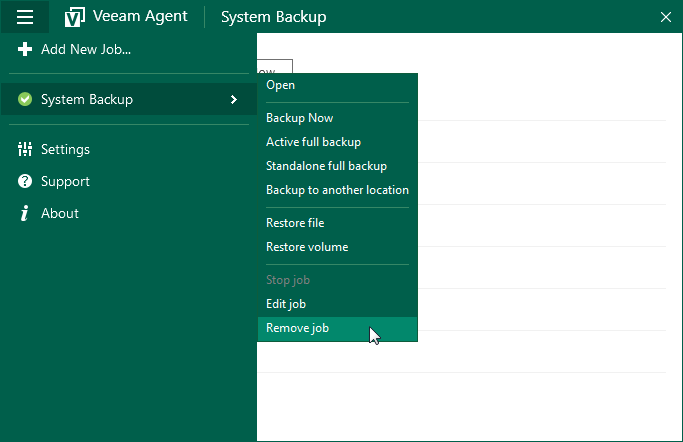

# Removing Backup Job

You can remove a backup job configured in Veeam Agent for Microsoft Windows. When you remove a backup job, Veeam Agent for Microsoft Windows also removes information about backup job sessions from the Veeam Agent database. After you remove the job, information about sessions of this job is not displayed in the Status view of the control panel any longer.

|  |
| --- |
|  NOTE |
| You cannot remove a backup job that is currently running. You must stop the job first. |

Backup files created by the deleted backup job remain intact in the target location.

To remove a backup job:

1. Double-click the Veeam Agent for Microsoft Windows icon in the system tray, or right-click the Veeam Agent for Microsoft Windows icon in the system tray and select Control Panel.
2. In the main menu, hover over the name of the backup job that you want to remove, and select Remove job.
3. In the displayed window, click Yes.

