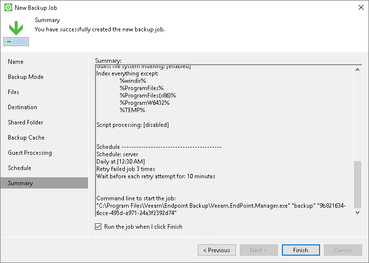

# Step 12. Review Backup Job Settings

At the Summary step of the wizard, complete the backup job configuration process.

1. Review settings of the configured backup job.

In addition to backup job settings, Veeam Agent for Microsoft Windows displays a command to start the job using the command-line interface.

1. To start the job after you close the wizard, select the Run the job when I click Finish check box.
2. Click Finish.

