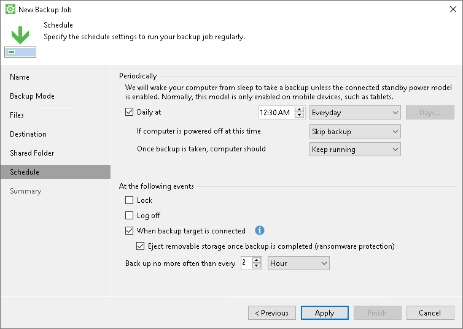

# Scheduling Settings in Free and Workstation Editions

At the Schedule step of the wizard, set up Veeam Agent for Microsoft Windows to run the backup job periodically at specific time or after specific computer events:

* [Select the time to launch the backup job](#periodically).
* [Select events that trigger the backup job launch](#events).

|  |
| --- |
|  IMPORTANT |
| If the power scheme on your computer does not allow using wake up timers, Veeam Agent for Microsoft Windows will ask you to change the power scheme settings. Click Yes to allow Veeam Agent for Microsoft Windows to wake your computer from sleep for backup.  You can manually change the power scheme settings on your computer. To do this, navigate to Control Panel > All Control Panel Items > Power Options > Edit Plan Settings. |

Selecting Time to Launch Backup Job

In the Periodically section, specify time to launch the backup job:

1. Select the Daily at check box and use the fields on the right to specify time and days when the backup job must start:

* Everyday — select this option to start the job at specific time daily.
* On week-days — select this option to start the job at specific time on week-days.
* On these days — select this option to start the job at specific time on selected days.

You can leave the Daily at check box unchecked to configure the backup job without daily schedule. In this case, you will still be able to use the configured backup job to perform backup automatically [at specific events](#events). You can also use the configured backup job to create ad-hoc incremental and standalone full backups. To learn more, see [Performing Ad-Hoc Backups](performing_adhoc_backups.md).

1. If you have selected the On these days option, click the Days button and clear check boxes for the days when the job must not start.
2. Select the action that Veeam Agent for Microsoft Windows must perform in case your computer is powered off at the time when the scheduled backup job must start.

* Backup once powered on — select this option if you want Veeam Agent for Microsoft Windows to start the scheduled backup job when you power on the computer.

If you select this option, when the computer starts, Veeam Agent will check for any missed scheduled backups and automatically run the missed backup type. If multiple backup types were missed, Veeam Agent will run the one with the highest priority. The priority order is: active full backup (highest), synthetic full backup, incremental backup (lowest).

|  |
| --- |
| IMPORTANT |
| Veeam Agent for Microsoft Windows will only identify missed backup types after the scheduled backup job has run at least once. Otherwise, Veeam Agent will create an incremental backup even if a full backup was missed. |

* Skip backup — select this option if you want Veeam Agent for Microsoft Windows not to start the scheduled backup job when the computer is powered on. Veeam Agent for Microsoft Windows will perform backup at the next scheduled time.

1. If you want Veeam Agent for Microsoft Windows to perform a finalizing action after the backup job completes successfully, select the necessary action:

* Keep running — select this option if the computer must keep on working.
* Sleep — select this option if you want Veeam Agent for Microsoft Windows to bring your computer to the standby mode.
* Shutdown — select this option if you want Veeam Agent for Microsoft Windows to shut down your computer.
* Hibernate — select this option if you want Veeam Agent for Microsoft Windows to bring your computer to the hibernate mode. This option is available if the hibernate mode is enabled on your computer. To learn more, see [Microsoft documentation](https://support.microsoft.com/en-us/kb/920730).

Veeam Agent for Microsoft Windows applies this setting only to scheduled backups. If you start standalone full backup or incremental backup manually, Veeam Agent for Microsoft Windows will ignore this setting, and the computer will not be shut down or brought to the standby mode when the backup job completes.

When the backup job completes, Veeam Agent for Microsoft Windows will prompt a dialog with a countdown to the selected post-job action. You can select to proceed to the action immediately or to cancel the action. To learn more, see [Controlling Backup Post-Job Action](post-job_activity_prompt.md).

Selecting Events that Trigger Backup Job Launch

In the At the following events section, specify computer events that trigger the backup job launch:

* Select the Lock check box if you want to start the scheduled backup job when the user locks the computer.

|  |
| --- |
| NOTE |
| The backup job does not always start right after the lock event is created. For example, when you put the Veeam Agent computer to sleep, the operating system creates the lock event before the entering sleep event but the backup job starts after the computer resumes from the sleep mode. The backup job does not start if the computer stayed in the sleep mode longer than 15 minutes. |

* Select the Log off check box if you want to start the scheduled backup job when the user working with the computer performs a logout operation.
* Select the When backup target is connected check box if you want to start the scheduled backup job when the backup storage becomes available. With this option selected, Veeam Agent will detect state changes for networks and drives. When such change is detected, Veeam Agent will check if the target backup repository is accessible. If so, it will start the backup job.
* Select the Eject removable storage once backup is completed check box if you want Veeam Agent for Microsoft Windows to unmount the storage device after the backup job completes successfully. With this option selected, backup files on the removable storage will be protected from encrypting ransomware, such as CryptoLocker.

Veeam Agent applies this setting only to backup jobs triggered by computer events. In case of backup jobs scheduled to run at specific time, Veeam Agent will ignore this setting, and the storage device will not be unmounted after the backup job completes successfully.

|  |
| --- |
| IMPORTANT |
| The Eject removable storage once backup is completed option does not guarantee a bulletproof protection against ransomware. To ensure your backups are safe, keep the OS up to date and regularly scan your backup repository for virus threats using modern antivirus software. |

* Use the Back up no more often than every <N> <time units> field to restrict the frequency of backup job sessions. Specify a minutely, hourly or daily interval between the backup job sessions.

The Back up no more often than every <N> <time units> option is applied only to job sessions started at specific events. Daily backups are performed according to defined schedule regardless of the time interval specified for this setting.

