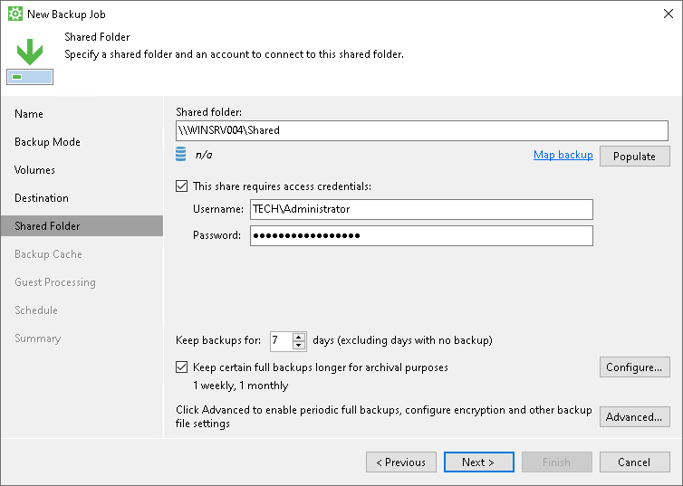
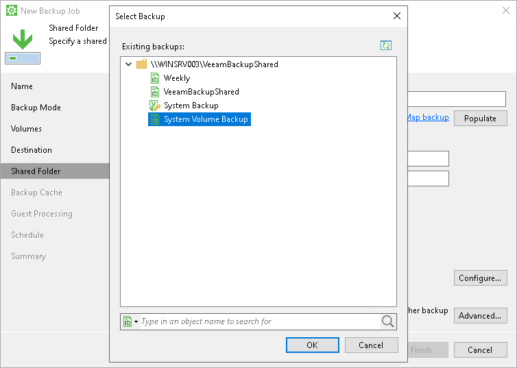

# Shared Folder Settings

The Shared Folder step of the wizard is available if you have chosen to save the backup in a network shared folder.

Specify shared folder settings:

1. In the Shared folder field, type a UNC name of the network shared folder in which you want to store backup files. Keep in mind that the UNC name always starts with two back slashes (\\).
2. If you want to map the job to a specific backup that was previously created on the same Veeam Agent computer, click the Map Backup link and select the backup.

To learn more, see [Mapping Backup Job](#map).

1. If the network shared folder requires authentication, select the This share requires access credentials check box and specify a user name and password of the account that has Full Control access permissions on this shared folder. The user name must be specified in the [down-level logon name](https://docs.microsoft.com/en-us/windows/win32/secauthn/user-name-formats#down-level-logon-name) format. For example, DOMAIN\UserName or HOSTNAME\UserName.

To view the specified password, click and hold the eye icon on the right of the Password field.

If you do not select the This share requires access credentials check box, Veeam Agent for Microsoft Windows will connect to the shared folder using the NT AUTHORITY\SYSTEM account of the computer where the product is installed. You can use this scenario if the Veeam Agent computer is joined to the Active Directory domain. In this case, you can grant Full Control access permissions on the shared folder and underlying file system to the computer account (DOMAIN\COMPUTERNAME$).

1. To view how much free space is available in the selected shared folder, click Populate.
2. In the Keep backups for <N> days (excluding days with no backup) field, specify the number of days for which you want to store backup files in the target location. By default, Veeam Agent keeps backup files for 7 days. After this period is over, Veeam Agent will remove the earliest restore points from the backup chain. To learn more, see [General Short-term Retention Policy](retention_days.md).
3. [For Workstation and Server product editions] To use the GFS (Grandfather-Father-Son) retention scheme, select the Keep certain full backups longer for archival purposes check box and click Configure. In the Configure GFS window, specify how weekly, monthly and yearly full backups must be retained. To learn more, see the [GFS Retention Policy](https://helpcenter.veeam.com/docs/vbr/userguide/backup_copy_gfs.html?ver=13) section in the Veeam Backup & Replication User Guide.
4. Click Advanced to specify advanced settings for the backup job. To learn more, see [Specify Advanced Backup Settings](backup_job_advanced.md).

Mapping Backup Job

If you have selected to map the job to the already created backup that is stored in a network shared folder, perform the following steps:

1. In the Shared folder field, specify the same path as was specified in the Shared folder field for the job that was used to create the backup.
2. Click Map backup and select the desired backup. To find the backup, you can use the search field at the bottom of the Select Backup window.

Keep in mind that Veeam Agent displays backups stored in the folder that is specified in the Shared folder field and its first-level subfolders.

1. If you map the job to an encrypted backup, and encryption keys are not available in the Veeam Agent database, you must provide the password specified for encryption. In the displayed window, enter the password and click OK.

