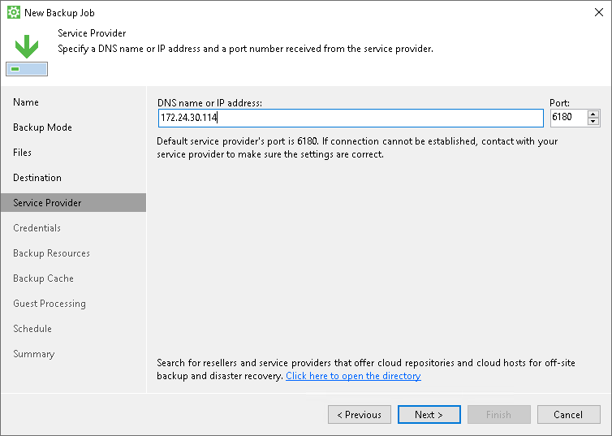
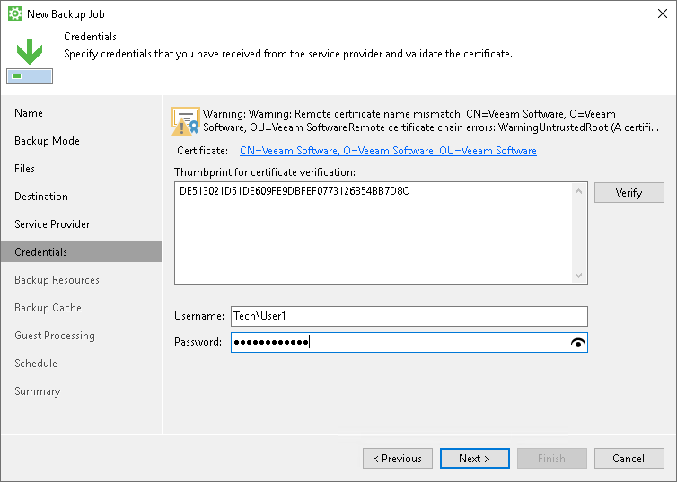
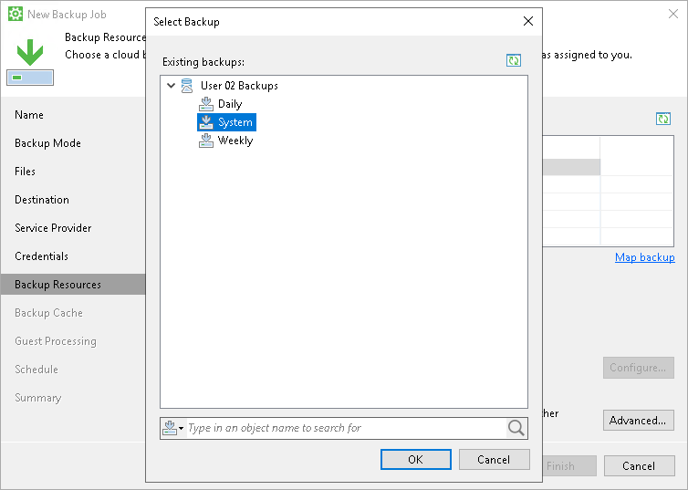

# Veeam Cloud Connect Repository Settings

If you have selected to store backup files in a Veeam Cloud Connect repository, specify settings to connect to the cloud repository:

1. [Specify service provider settings](#sp).
2. [Verify the TLS certificate and specify user account settings](#tenant).
3. [Select the cloud repository](#repo).

Specifying Service Provider Settings

The Service Provider step of the wizard is available if you have chosen to save backup files in a Veeam Cloud Connect repository.

Specify settings for the cloud gateway that the SP or your backup administrator has provided to you:

1. In the DNS name or IP address field, enter a full DNS name or IP address of the cloud gateway.
2. In the Port field, specify the port over which Veeam Agent for Microsoft Windows will communicate with the cloud gateway. By default, port 6180 is used.

|  |
| --- |
|  TIP |
| You can look for service providers who offer Repository as a Service using Veeam Backup & Replication. The list of service providers is published on the Veeam website and constantly updated. You can select the necessary service provider from the list and contact this service provider to get the cloud repository service.  To find a service provider, click the Click here to open the directory link. Veeam Agent for Microsoft Windows will open a webpage on the Veeam website. Use the filter on the webpage to find the necessary service provider by the type of provided cloud services, service provider datacenter location or service area. |

Specifying User Account Settings

The Credentials step of the wizard is available if you have chosen to save backup files in a cloud repository and specified settings for the cloud gateway.

Verify TLS certificate settings and specify settings for the tenant account or subtenant account that you want to use to connect to the cloud repository.

1. At the top of the wizard window, Veeam Agent for Microsoft Windows displays information about the TLS certificate obtained from the SP side. You can view the certificate settings and verify the TLS certificate.

TLS certificate verification is optional. You can use this option to verify self-signed TLS certificates. TLS certificates signed by the trusted CA do not require additional verification.

* To view the TLS certificate, click the certificate link.
* To verify the TLS certificate with a thumbprint, copy the thumbprint you obtained from the SP to the Clipboard and enter it to the Thumbprint for certificate verification field. Click Verify. Veeam Agent for Microsoft Windows will check if the thumbprint you enter matches the thumbprint of the obtained TLS certificate.

1. In the Username field, enter the user name of the tenant or subtenant account that the SP or your backup administrator has provided to you. The user name of the subtenant account must be specified in the TENANT\SUBTENANT format.
2. In the Password field, provide a password for the tenant or subtenant account.

Selecting Cloud Repository

The Backup Resources step of the wizard is available if you have chosen to save backup files in a cloud repository and specified settings to connect to the SP.

Specify settings for the cloud repository:

1. From the Available cloud repositories list, select a cloud repository where you want to store created backups. The Available cloud repositories list displays only those backup repositories on which you have permissions to store data.

To refresh the list of cloud repositories, click the Refresh button at the top right corner of the Available cloud repositories field. Cloud repositories list refresh may be required if you change permission settings for a specific cloud repository and want to display this cloud repository in the New Backup Job wizard.

1. If you want to map the job to a specific backup that was previously created on the same Veeam Agent computer, click the Map Backup link and select the backup.

To learn more, see [Mapping Backup Job](#map).

1. In the Keep backups for <N> days (excluding days with no backup) field, specify the number of days for which you want to store backup files in the target location. By default, Veeam Agent keeps backup files for 7 days. After this period is over, Veeam Agent will remove the earliest restore points from the backup chain. To learn more, see [General Short-term Retention Policy](retention_days.md).

1. [For Workstation and Server product editions] To use the GFS (Grandfather-Father-Son) retention scheme, select the Keep certain full backups longer for archival purposes check box and click Configure. In the Configure GFS window, specify how weekly, monthly and yearly full backups must be retained. To learn more, see the [GFS Retention Policy](https://helpcenter.veeam.com/docs/vbr/userguide/backup_copy_gfs.html?ver=13) section in the Veeam Backup & Replication User Guide.

1. Click Advanced to specify advanced settings for the backup job. To learn more, see [Specify Advanced Backup Settings](backup_job_advanced.md).

Mapping Backup Job

If you have selected to map the job to the already created backup, perform the following steps:

1. Click Map backup and select the desired backup. To find the backup, you can use the search field at the bottom of the Select Backup window. Keep in mind that Veeam Agent displays only those backups that were created on the same Veeam Agent computer with the same tenant or subtenant account used to connect to the repository.

1. If you map the job to an encrypted backup, and encryption keys in the cloud repository database do not coincide with the encryption keys in the Veeam Agent database, you must provide the password specified for encryption after the job start. In the dialog window, enter the password and click OK. To learn more, see [Resuming Encrypted Backup Chain](encrypted_backup_chain.md).

The backup job mapping can also be helpful in case of the backup seeding. If you want to seed backup files, you must place these files in a specific folder on the target location. On the cloud repository, Veeam Agent stores backups in the folders with paths of the following format:

* If a tenant account is specified in the Username field at the Credentials step of the wizard:

<path\_to\_repository>\<tenant\_name>\<backup\_job\_name>

* If a subtentant account is specified in the Username field at the Credentials step of the wizard:

<path\_to\_repository>\<tenant\_name>\Users\<subtenant\_name>\<backup\_job\_name>

where:

* <path\_to\_repository> — path to the folder on the cloud repository.
* <tenant\_name> — name of the tenant account.
* <subtenant\_name> — name of the subtenant account.
* <backup\_job\_name> — name of the backup job.

For example:

* C:\Backup\TechCompany\System Backup

or

* C:\Backup\TechCompany\Users\User01\System Backup

To learn more about backup seeding scenarios for cloud repositories, see [Moving Veeam Agent Backups to Veeam Cloud Connect Repository](appendix_move_backups_to_vcc.md).

