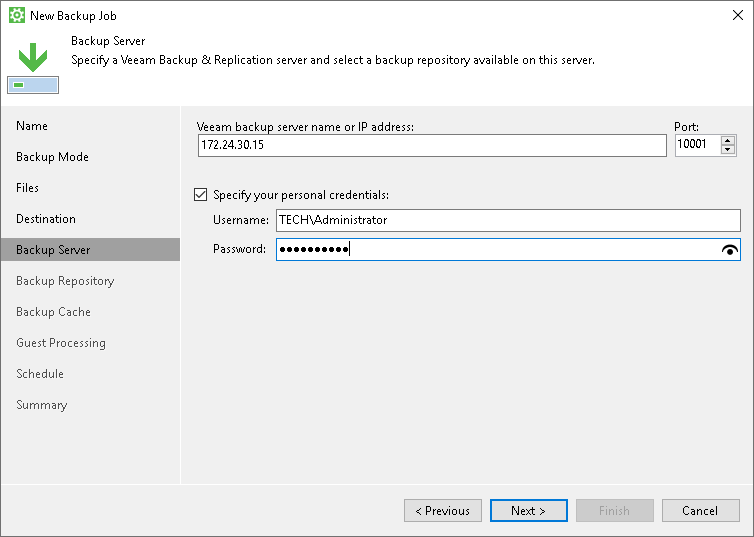
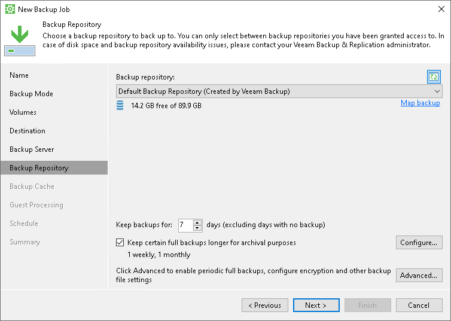
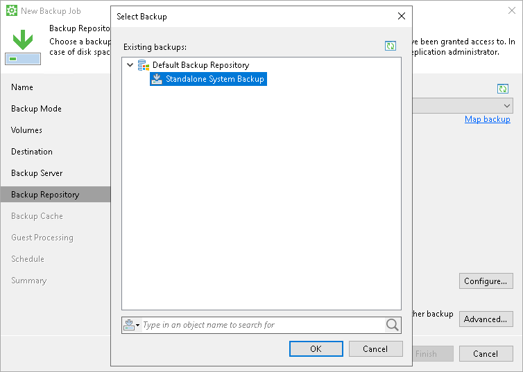

# Veeam Backup Repository Settings

If you have selected to store backup files in a Veeam backup repository, specify settings to connect to the backup repository:

1. [At the Backup Server step of the wizard, specify backup server settings](#vbr).
2. [At the Backup Repository step of the wizard, select the Veeam backup repository](#repo).

Specifying Backup Server Settings

The Backup Server step of the wizard is available if you have chosen to store backup files in a Veeam backup repository.

Specify settings for the Veeam backup server that manages the target backup repository:

1. In the Veeam backup server name or IP address field, specify a DNS name or IP address of the Veeam backup server.
2. In the Port field, specify a number of the port over which Veeam Agent for Microsoft Windows must communicate with the backup server. By default, Veeam Agent for Microsoft Windows uses port 10005.
3. Select the Specify your personal credentials check box. In the Username and Password fields, specify a user name and password of the account that has access to this backup repository. Permissions on the backup repository managed by the target Veeam backup server must be granted beforehand. To learn more, see [Setting Up User Permissions on Backup Repositories](integrate_permissions.md).

If you do not select the Specify your personal credentials check box, Veeam Agent for Microsoft Windows will connect to the backup repository using the NT AUTHORITY\SYSTEM account of the computer where the product is installed. You can use this scenario if the Veeam Agent computer is joined to the Active Directory domain. In this case, you can add the computer account (DOMAIN\COMPUTERNAME$) to an AD group and grant access rights on the backup repository to this group.

Setting access permissions on the backup repository to Everyone is equal to granting access rights to the Everyone Microsoft Windows group (Anonymous users are excluded). If you have set such permissions on the backup repository, you can omit specifying credentials. However, we recommend this scenario for demo environments only.

|  |
| --- |
|  IMPORTANT |
| Consider the following:   * If you plan to use a commercial version of Veeam Agent with Veeam Backup & Replication, you must install a license in Veeam Backup & Replication in advance, before connecting to the backup server. * If you change an account to connect to the Veeam backup server and then start a backup job targeted at the backup repository managed by this backup server, Veeam Agent will start a new backup chain in the backup repository. |

Selecting Backup Repository

The Backup Repository step of the wizard is available if you have chosen to save backup files in a Veeam backup repository.

Specify settings for the target backup repository:

1. From the Backup repository list, select a backup repository where you want to store created backups. The Backup repository list displays only those backup repositories on which you have permissions to store data.

To refresh the list of backup repositories, click the Refresh button at the top right corner of the Backup repository field. Backup repositories list refresh may be required if you change permission settings for a specific backup repository on the Veeam backup server and want to display this backup repository in the New Backup Job wizard. To learn more, see [Setting Up User Permissions on Backup Repositories](integrate_permissions.md).

1. If you want to map the job to a specific backup that was previously created on the same Veeam Agent computer, click the Map Backup link and select the backup.

To learn more, see [Mapping Backup Job](#map).

1. In the Keep backups for <N> days (excluding days with no backup) field, specify the number of days for which you want to store backup files in the target location. By default, Veeam Agent keeps backup files for 7 days. After this period is over, Veeam Agent will remove the earliest restore points from the backup chain. To learn more, see [General Short-term Retention Policy](retention_days.md).

1. [For Workstation and Server product editions] To use the GFS (Grandfather-Father-Son) retention scheme, select the Keep certain full backups longer for archival purposes check box and click Configure. In the Configure GFS window, specify how weekly, monthly and yearly full backups must be retained. To learn more, see the [GFS Retention Policy](https://helpcenter.veeam.com/docs/vbr/userguide/backup_copy_gfs.html?ver=13) section in the Veeam Backup & Replication User Guide.
2. Click Advanced to specify advanced settings for the backup job. To learn more, see [Specify Advanced Backup Settings](backup_job_advanced.md).

Mapping Backup Job

If you have selected to map the job to the already created backup that is stored in a Veeam backup repository, perform the following steps:

1. If you map the job to an encrypted backup, you must decrypt the backup on the Veeam Backup & Replication side before mapping. To learn more, see the [Restoring Data from Encrypted Backups](https://helpcenter.veeam.com/docs/vbr/userguide/restore_encrypted.html?ver=13) section in the Veeam Backup & Replication User Guide.
2. Click the Map backup link and select the desired backup. To find the backup, you can use the search field at the bottom of the Select Backup window. Keep in mind that Veeam Agent displays only those backups that were created on the same Veeam Agent computer with the same account used to connect to the repository.

The backup job mapping can be helpful in case of the backup seeding. If you want to seed backup files, you must place these files in a specific folder on the target location. In the Veeam backup repository, Veeam Agent stores backups in the folders with paths of the following format:

<path\_to\_folder>\<domain\_name>\_<user\_name>\<backup\_job\_name>

where:

* <path\_to\_folder> — path to the folder in the Veeam backup repository.
* <domain\_name> — domain name or server name specified to connect to the repository.
* <user\_name> — user name specified to connect to the repository.
* <backup\_job\_name> — name of the backup job.

For example:

C:\Backup\TECH\_Administrator\System Backup

To learn more about backup seeding scenarios for Veeam backup repositories, see [Moving Veeam Agent Backups to Veeam Backup Repository](appendix_move_backups_to_vbr.md).

