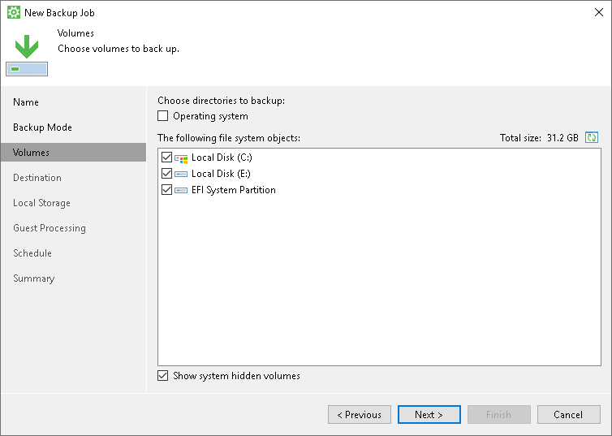

# Selecting Volumes to Back Up

The Volumes step of the wizard is available if you have chosen to create a volume-level backup.

At this step of the wizard, you must specify the backup scope — define what volumes you want to include in the backup.

To specify the backup scope, choose volumes and objects that you want to include in the backup. You can include the following data in the backup:

* Computer volumes (located on local drives or external USB drives). To include individual volumes of your computer to the backup scope, select check boxes next to necessary volumes.

If you select all volumes at this step of the wizard, Veeam Agent will create a backup of the entire computer image. However, if a new volume appears on a Veeam Agent computer, Veeam Agent will not include this volume in the backup scope automatically. Veeam Agent will back up only those volumes that are explicitly selected for backup.

* Mount points. To include individual volumes mounted on your computer to the backup scope, select check boxes next to necessary mount points.

In the list of objects to back up, Veeam Agent displays available mount points after volumes.

* System state data. To include system state data into the backup, do one of the following:

* In the Choose directories to backup list, select the Operating system check box.
* In the The following file system objects list, select the check box next to the system volume. Typically, the system volume is the Local Disk (C:) volume.
* Select the Show system hidden volumes check box at the bottom of the window. In the The following file system objects list, select the System Reserved/EFI System Partition check box and the check box next to the system volume. Typically, the system volume is the Local Disk (C:) volume.

When you include a system volume in the backup, Veeam Agent automatically includes the System Reserved/UEFI or other system partitions in the backup too. For GPT disks on Microsoft Windows Server from version 2012 R2 to version 2025, Veeam Agent will additionally back up the recovery partition. If you do not want to back up the system state data, you can clear the System Reserved/EFI System Partition check box. However, in this case Veeam Agent does not guarantee that the OS will boot properly when you attempt to recover from such backup. To learn more, see [System State Data Backup](system_state_backup.md).

|  |
| --- |
| NOTE |
| Consider the following:   * Veeam Agent cannot back up hidden non-system volumes. * You cannot include in the backup volumes located on virtual hard disks (VHD or VHDX). * Veeam Agent automatically adds to the list of exclusions the following Microsoft Windows objects for all computer users: temporary files folder, Recycle Bin, Microsoft Windows pagefile, hibernate file and VSS snapshot files from the System Volume Information folder. |

