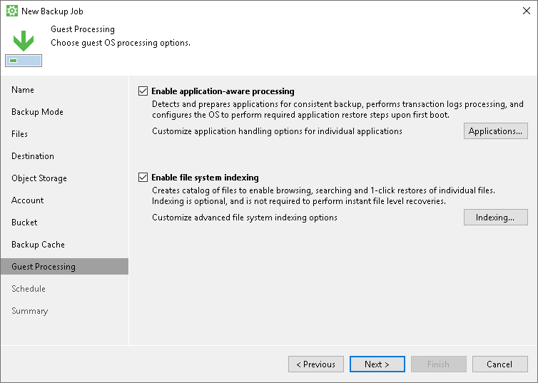

# Step 10. Specify Guest Processing Settings

The Guest Processing step of the wizard is available in the Server edition of Veeam Agent for Microsoft Windows.

You can enable the following settings for guest OS processing:

* [Application-aware processing](backup_job_vss_general.md)
* [Transaction log handling for Microsoft SQL Server](backup_job_vss_sql.md)
* [Archived log handling for Oracle databases](backup_job_vss_oracle.md)
* [SharePoint account settings](backup_job_vss_sharepoint.md)
* [Use of pre-freeze and post-thaw scripts](backup_job_vss_scripts.md)
* [File indexing](backup_job_vss_indexing.md)

