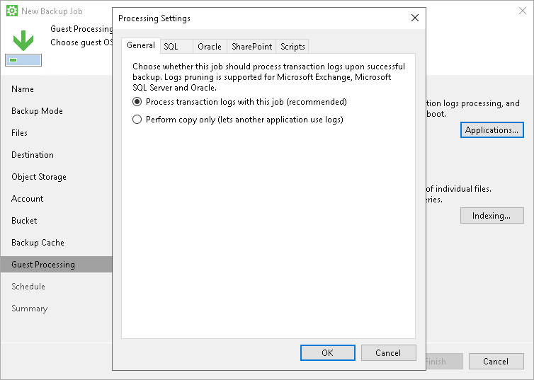

# Application-Aware Processing

If your computer runs VSS-aware applications, you can enable application-aware processing to create a transactionally consistent backup. The transactionally consistent backup guarantees proper recovery of applications without data loss.

To enable application-aware processing:

1. At the Guest Processing step of the wizard, make sure that the Enable application-aware processing check box is selected.
2. Click Applications.
3. In the Processing Settings window, on the General tab, specify if Veeam Agent must process transaction logs [For Microsoft Exchange, Microsoft SQL and Oracle] or copy-only backups must be created.

1. Select Process transaction logs with this job if you want Veeam Agent to process transaction logs.

* [For Microsoft Exchange] With this option selected, Veeam Agent will wait for backup to complete successfully and then trigger truncation of transaction logs. If the backup job fails, the logs will remain untouched until the next backup job session.

* [For Microsoft SQL Server and Oracle] You will have to specify settings for transaction log handling on the SQL and Oracle tabs of the Processing Settings window. For more information, see [Microsoft SQL Server Transaction Log Settings](backup_job_vss_sql.md) and [Oracle Archived Log Settings](backup_job_vss_oracle.md).

1. Select Perform copy only if you use another tool to maintain consistency of the database state. Veeam Agent will create a copy-only backup. The copy only backup preserves the chain of full/differential backup files and transaction logs. After a copy-only backup, Veeam Agent does not trigger truncation of transaction logs. For more information, see [Microsoft documentation](http://msdn.microsoft.com/en-us/library/ms191495.aspx).

|  |
| --- |
|  IMPORTANT |
| Consider the following:   * [For Microsoft Exchange] Veeam Agent for Microsoft Windows performs truncation of Microsoft Exchange transaction logs only if all disks that contain Microsoft Exchange databases and logs are included in a volume-level backup job. * [For Microsoft SQL Server and Oracle] If both Microsoft SQL Server and Oracle Server are installed on the same guest OS, enable log backup settings for one application only: either Microsoft SQL Server or Oracle. If log backup is enabled for both applications, Veeam Agent for Microsoft Windows will back up only Oracle transaction logs. Microsoft SQL Server transaction logs will not be processed. |

