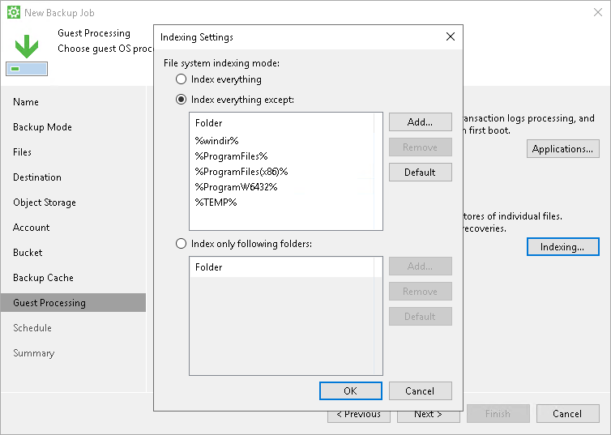

# File Indexing

To specify file indexing options:

1. At the Guest Processing step of the wizard, click Indexing.
2. In the Indexing Settings window, specify the indexing scope:

* Select Index everything if you want to index all files within the backup scope that you have specified at the [Backup mode](backup_job_mode.md) step of the wizard. Veeam Agent for Microsoft Windows will index all files that reside:

* on your computer OS (for entire computer backup)
* on the volumes that you have selected for backup (for volume-level backup)
* in the directories that you have selected for backup (for file-level backup)

* Select Index everything except if you want to index all files on your computer OS except those defined in the list. By default, system folders are excluded from indexing. You can add or delete folders using the Add and Remove buttons on the right. You can also use system environment variables to form the list, for example: %windir%, %ProgramFiles% and %Temp%.

To reset the list of folders to its initial state, click Default.

* Select Index only following folders to define folders that you want to index. You can add or delete folders to index using the Add and Remove buttons on the right. You can also use system environment variables to form the list, for example: %windir%, %ProgramFiles% and %Temp%.

