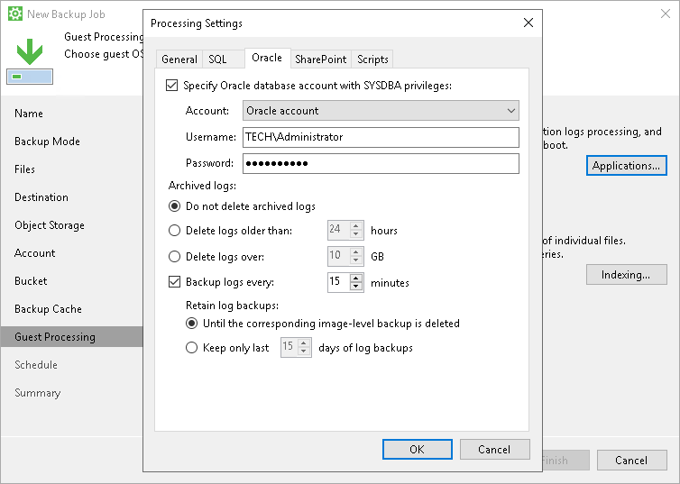

# Oracle Archived Log Settings

If you back up an Oracle database, you can specify how Veeam Agent for Microsoft Windows must process archived logs:

1. At the Guest Processing step of the wizard, make sure that the Enable application-aware processing check box is selected.
2. Click Applications.
3. In the Processing Settings window, on the General tab, select Process transaction logs with this job.
4. In the Processing Settings window, click the Oracle tab.
5. Specify a user account that Veeam Agent for Microsoft Windows will use to connect to the Oracle database:

1. Select the Specify Oracle database account with SYSDBA privileges check box.
2. In the Account field, select what type of user account you plan to use: Oracle account or Windows account.
3. In the Username and Password fields, enter a username and password for the account.

The specified account must have SYSDBA rights on the Oracle database.

1. In the Archived logs section, specify if Veeam Agent for Microsoft Windows must delete archived logs on the Oracle database:

* Select Do not delete archived logs if you want Veeam Agent for Microsoft Windows to preserve archived logs. When the backup job completes, Veeam Agent for Microsoft Windows will not delete archived logs.

We recommend that you select this option for databases for which the ARCHIVELOG mode is turned off. If the ARCHIVELOG mode is turned on, archived logs may grow large and consume all disk space. In this case, the database administrator must take care of archived logs him-/herself.

* Select Delete logs older than <N> hours or Delete logs over <N> GB if you want Veeam Agent for Microsoft Windows to delete archived logs that are older than <N> hours or larger than <N> GB. Veeam Agent for Microsoft Windows will wait for the backup to complete successfully and then trigger archived logs deletion through Oracle Call Interface (OCI). If the backup job fails, the logs will remain untouched until the next backup job session.

|  |
| --- |
| TIP |
| If you configure backup job to back up archived logs, Veeam Agent also triggers archived logs deletion after each log backup job session. |

1. To back up Oracle archived logs with Veeam Agent for Microsoft Windows, select the Backup log every <N> minutes check box and specify the frequency for archived log backup. By default, archived logs are backed up every 15 minutes. The maximum log backup interval is 480 minutes.

|  |
| --- |
|  NOTE |
| You can enable archived log backup in one backup job only. If you have already configured a job that is set up to back up archived logs, you will not be able to select the Backup logs every <N> minutes option in the properties of another backup job. |

1. In the Retain log backups section, specify retention policy for archived logs stored in the backup location:

* Select Until the corresponding image-level backup is deleted to apply the same retention policy for Veeam Agent backups and archived log backups.
* Select Keep only last <n> days to keep archived logs for a specific number of days. By default, archived logs are kept for 15 days. If you select this option, you must make sure that retention for archived logs is not greater than retention for the Veeam Agent backups. For more information, see [Retention for Archived Log Backups](sql_backup_retention.md).

