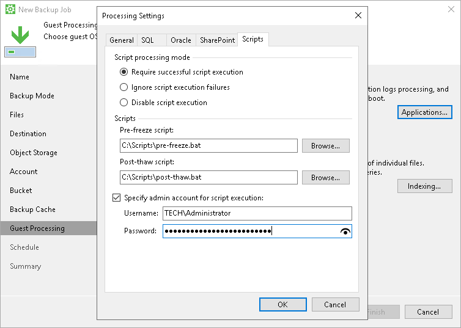

# Pre-Freeze and Post-Thaw Scripts

If you plan to back up data of applications that do not support VSS, you can specify what scripts Veeam Agent for Microsoft Windows must use to quiesce the OS on your computer. The pre-freeze script quiesces the file system and application data to bring the OS to a consistent state before Veeam Agent for Microsoft Windows requests the creation of a VSS snapshot. After the VSS snapshot is created, the post-thaw script brings the file system and applications to their initial state.

To specify pre-freeze and post-thaw scripts for the job:

1. At the Guest Processing step, click Applications.
2. In the Processing Settings window, click the Scripts tab.
3. In the Script processing mode section, specify the scenario for scripts execution:

* Select Require successful script execution if you want Veeam Agent for Microsoft Windows to stop the backup process if the script fails.

* Select Ignore script execution failures if you want to continue the backup process even if script errors occur.
* Select Disable script execution if you do not want to run scripts.

1. In the Scripts section, specify paths to pre-freeze and post-thaw scripts. Scripts must reside on a local drive of the Veeam Agent computer.

Veeam Agent for Microsoft Windows supports scripts in the .EXE, .BAT, .CMD and .PS1 formats.

You can use scripts of other formats as well, but we cannot guarantee correct processing of such scripts.

1. By default, Veeam Agent for Microsoft Windows performs guest processing activities under the Local System account. To specify a user account that Veeam Agent for Microsoft Windows will use to run pre-freeze and post-thaw scripts, select the Specify admin account for script execution check box and enter a user name and password for the user account.

Related Topics

[Pre-Freeze and Post-Thaw Scripts](pre_post_scripts.md)

