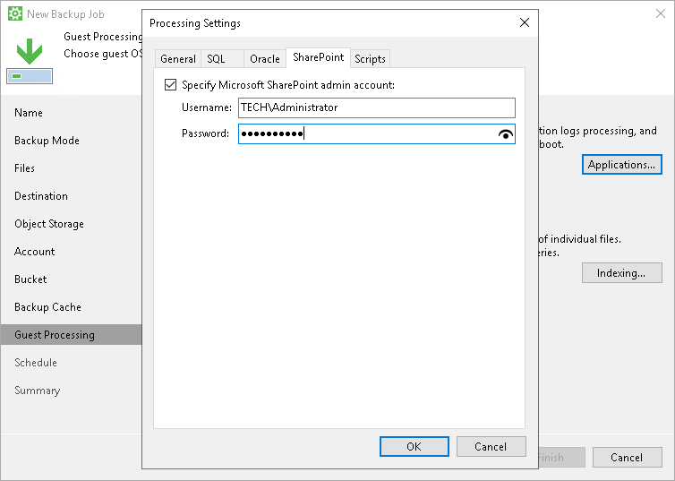

# Microsoft SharePoint Account Settings

If you back up Microsoft SharePoint, you must specify a user account that has enough permissions on the application:

1. At the Guest Processing step of the wizard, make sure that the Enable application-aware processing check box is selected.
2. Click Applications.
3. In the Processing Settings window, click the SharePoint tab.
4. Select the Specify Microsoft SharePoint admin account check box and enter a user name and password for the user account.

