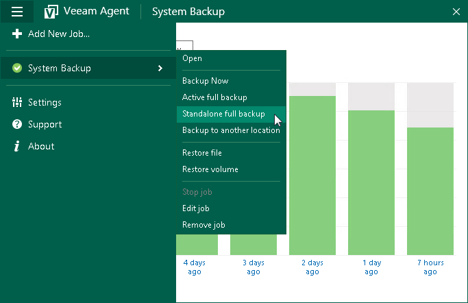

# Creating Standalone Full Backups

If you want to back up your data at a specific point in time, you can create a standalone full backup. The standalone full backup is independent: it is not followed by subsequent incremental backups and is not removed by retention. You can use the standalone full backup to create an additional restore point from which you can recover your data.

Before you create a standalone full backup, check the following prerequisites and limitations:

* The backup job must be configured.
* A user account under which you start the Standalone full backup operation must have administrative privileges on the Veeam Agent computer. If the account under which you are currently logged on to Microsoft Windows does not have administrative privileges, you will be prompted to enter administrator credentials.
* You cannot create a standalone full backup if a backup task of any type is currently running. This includes a scheduled backup, standalone full backup, active full backup or ad-hoc incremental backup.
* You cannot create a standalone full backup if you have chosen to store backup files in one of the following locations:

* Veeam backup repository
* Veeam Cloud Connect repository
* Object storage

If you want to create a full backup file not associated with the backup chain, you can perform standalone full backup to another location. To learn more, see [Performing Backup to Another Location](backup_standalone_full_location.md).

To create a standalone full backup:

1. Double-click the Veeam Agent for Microsoft Windows icon in the system tray or right-click it and select Control Panel.
2. In the main menu, hover over the name of the backup job that you want to use to create a standalone full backup, and select Standalone full backup. Veeam Agent for Microsoft Windows will create a full backup file using settings of the backup job. The resulting full backup file will be saved in the target location specified in the job settings, and placed to a separate folder. The folder is named in the following way: <BackupJobName>.adhoc.<DateandTime>.

If only one job is configured in Veeam Agent for Microsoft Windows, you can also start the standalone full backup task from the system tray menu:

1. Right-click the Veeam Agent for Microsoft Windows icon in the system tray.
2. Select Backup > Standalone full backup.

|  |
| --- |
|  NOTE |
| The Backup option is not available in the system tray menu if multiple backup jobs are configured in Veeam Agent for Microsoft Windows. |

You can also create a standalone full backup in a location that is not specified in the backup job settings. To learn more, see [Performing Backup to Another Location](backup_standalone_full_location.md).

Related Topics

[Standalone Full Backup](adhoc_backup_full.md)

