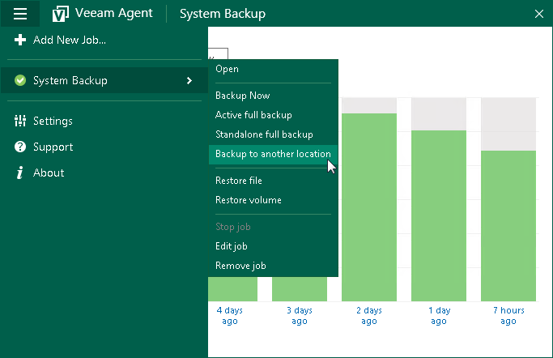

# Performing Backup to Another Location

You can create a standalone full backup in a separate location that is not specified as a target location in the backup job settings. Performing backup to another location is similar to creating regular standalone full backups. The main difference is that you must manually select a target location in which Veeam Agent for Microsoft Windows will save the backup file.

Before you perform backup to another location, check the following prerequisites:

* The backup job must be configured.
* You cannot perform backup to another location if a backup task of any type is currently running. This includes a scheduled backup, standalone full backup, active full backup or ad-hoc incremental backup.

* A user account under which you start the Backup to another location operation must have administrative privileges on the Veeam Agent computer. If the account under which you are currently logged on to Microsoft Windows does not have administrative privileges, you will be prompted to enter administrator credentials.

To perform backup to another location:

1. Double-click the Veeam Agent for Microsoft Windows icon in the system tray or right-click it and select Control Panel.
2. In the main menu, hover over the name of the backup job that you want to use to perform backup, and select Backup to another location.

|  |
| --- |
|  NOTE |
| If only one job is configured in Veeam Agent for Microsoft Windows, you can also start the standalone full backup task from the system tray menu:   1. Right-click the Veeam Agent for Microsoft Windows icon in the system tray. 2. Select Backup > Backup to another location.   Note that the Backup option is not available in the system tray menu if multiple backup jobs are configured in Veeam Agent. |

1. In the standalone full backup dialog window, specify the target location for the backup file:

* If you want to save the backup file in a folder on a local drive or a removable storage device, click Browse and select the necessary folder or type a path to the folder where backup file must be saved.
* If you want to save the backup file in a network shared folder, type a UNC name of the network shared folder. Keep in mind that the UNC name always starts with two back slashes (\\). If the network shared folder requires authentication, specify a user name and password of the account that has access permissions on this shared folder. The user name must be specified in the DOMAIN\UserName format.

1. Click Backup.

Veeam Agent for Microsoft Windows will create a full backup file using settings of the selected backup job. The resulting full backup file will be saved in a separate folder in the specified location. The folder is named in the following way: <BackupJobName>.adhoc.<DateandTime>.

Related Topics

[Standalone Full Backup to Another Location](adhoc_backup_full.md#another_location)

