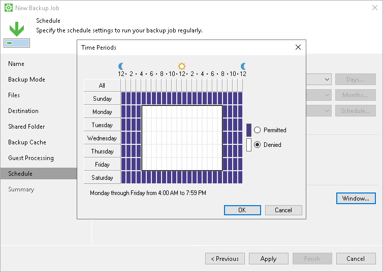

# Backup Window

If necessary, you can specify a backup window for the backup job. The backup window is a period of time on week days when the job is permitted to run.

The backup window can be helpful if you do not want the data protection job to produce unwanted overhead for the production environment or do not want the job to overlap production hours. In this case, you can define the time interval during which the job must not run.

If the job exceeds the allowed window, it will be automatically terminated. In this case, data transport and backup chain transformation processes are stopped.

|  |
| --- |
|  IMPORTANT |
| The backup window does not affect the process of uploading backup files from the backup cache to the target storage. If Veeam Agent creates one or more backup files in the backup cache, and then the backup target becomes available, Veeam Agent uploads backup files to the target location immediately, regardless of the specified backup window. |

Backup Window for Periodically Run Job

If you define the backup window for the job that runs periodically at specific time intervals, Veeam Agent will immediately start the job after the denied window is over. All subsequent backup job sessions will be performed according to specified scheduling settings.

For example, you have configured the job to run with a 4-hour interval with an offset of 15 minutes. The allowed backup window for the job is 7:00 PM to 8:00 AM. Veeam Agent will run this job in the following way:

1. The first job session will start at 12:15 AM (since midnight is a reference time for periodically run jobs).
2. The next job session will start at 4:15 AM.
3. The job session at 8:15 AM will not be performed, because it falls into the denied period of the backup window.
4. The next job session will start immediately after the denied period is over: at 7:15 PM.
5. After that, Veeam Agent for Microsoft Windows will run the job by the defined schedule: at 8:15 PM, 12:15 AM and so on.

