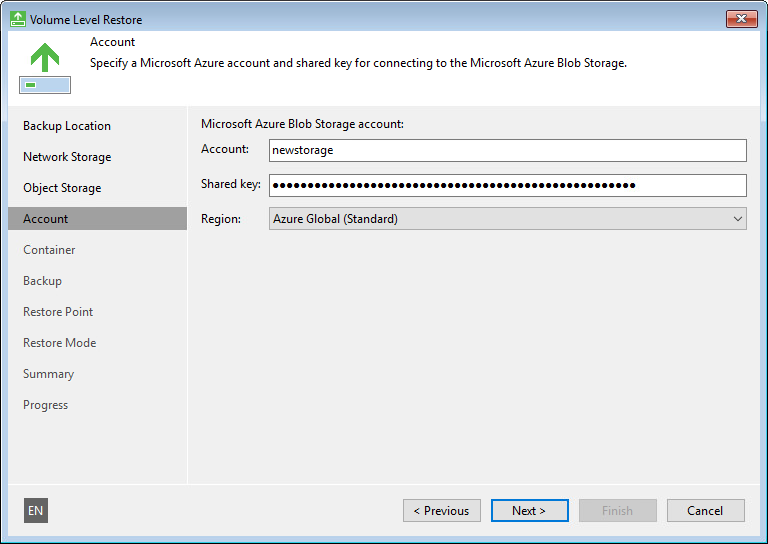
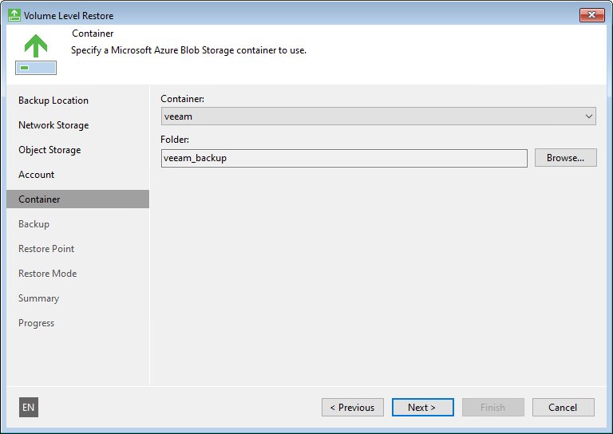

# Microsoft Azure Blob Storage Settings

If you have selected to restore data from a backup file located in the Microsoft Azure Blob storage, specify the following settings:

1. [Specify account settings](#storage).
2. [Specify container settings](#bucket).

Specifying Account Settings

The Account step of the wizard is available if you have chosen to restore data from a backup file located in object storage.

To connect to the Microsoft Azure Blob storage, specify the following:

1. In the Account field, enter the storage account name.
2. In the Shared key field, enter the storage account shared key.

1. From the Region drop-down list, select the Microsoft Azure region. By default, Veeam Agent uses the Azure Global (Standard) region.

Specifying Container Settings

The Container step of the wizard is available if you have chosen to restore data from a backup file located in the Microsoft Azure Blob storage and specified account settings to connect to the storage.

Specify settings for the container in the storage:

1. From the Container drop-down list, select a container in the storage.
2. In the Folder field, specify a folder in the container:

1. Select the Browse option.
2. In the Select Folder window, do the following:

1. Double-click the container name or click the arrow to the left of the container name to view the list of available folders.
2. Select the necessary folder and click OK.

