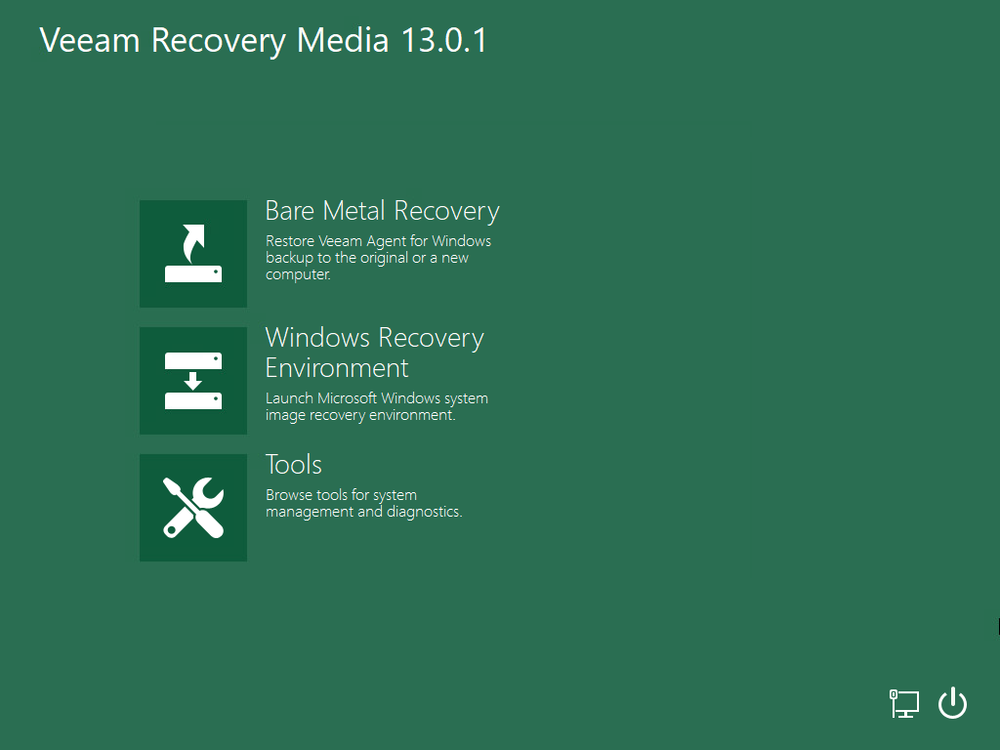

# Step 1. Boot from Veeam Recovery Media

To boot from the Veeam Recovery Media:

1. Depending on the type of the media storing the recovery image, do the following:

* [For CD/DVD/BD] Power on your computer. Insert the media with the recovery image to the drive and power off the computer.
* [For removable storage device] Attach the removable storage device with the recovery image to your computer.

1. Start your computer.
2. If you did not disable the prompt when [creating the Veeam Recovery Media](image_create.md), you will be offered to boot the OS from the CD/DVD/BD or attached removable storage. Press any key on the keyboard to continue.

If the prompt was disabled, the boot will start automatically.

1. Wait for Veeam Agent for Microsoft Windows to load files from the Veeam Recovery Media. Loading the OS from the Veeam Recovery Media usually takes more time than loading the OS from the local computer drive.
2. After the OS has loaded, make sure network settings are specified correctly and configure network if necessary. To learn more, see [Select Network Adapter or Wireless Network](baremetal_network.md).
3. Choose the necessary recovery tool to use. Veeam Agent for Microsoft Windows offers the following tools:

* [Bare Metal Recovery](baremetal_launch.md) — the Veeam Recovery Media wizard to recover data on the original computer or perform bare metal recovery.
* [Windows Recovery Environment](image_boot_windows.md) — built-in Microsoft Windows tools to recover the computer system image.
* [Tools](image_boot_endpoint.md) — Veeam Agent for Microsoft Windows and Microsoft Windows utilities for advanced computer administration.

|  |
| --- |
|  TIP |
| Consider the following:   * To shut down or restart your computer, click the Power Options button at the bottom right corner of the Veeam Recovery Media screen and select the necessary option: Shut down or Restart. * You can use the Veeam Recovery Media to start the Microsoft Windows OS in the safe mode. To do this, click the Power Options button at the bottom right corner of the Veeam Recovery Media screen and select Boot in safe mode. In the displayed window, select the necessary safe boot mode (Minimal, Network or Repair), and click OK. |

