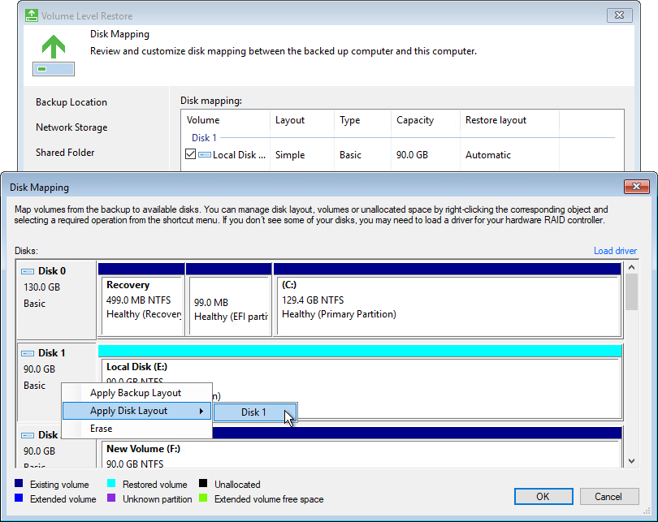
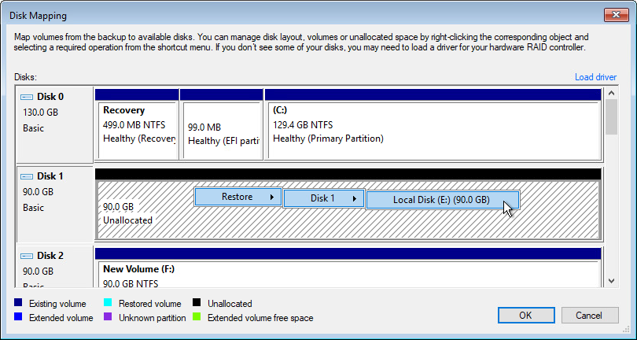
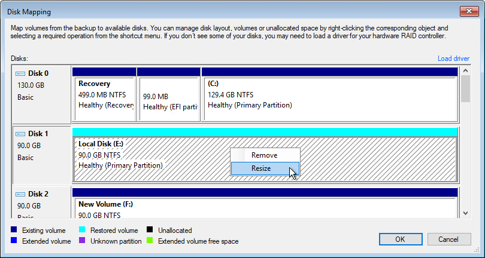

# Step 10. Map Restored Disks

The Disk Mapping step of the wizard is available if at the [Restore Mode](baremetal_mode.md) step of the wizard you have chosen to restore data in the Manual mode.

You can map volumes that you want to restore from the backup to disks on the target computer.

|  |
| --- |
|  IMPORTANT |
| We strongly recommend that you change disk mapping settings only if you have experience in working with Microsoft Windows disks and partitions. If you make a mistake, your computer data may get corrupted. |

To map volumes:

1. Select check boxes next to volumes that you want to restore from the backup.
2. [For restore to a new location] By default, Veeam Agent for Microsoft Windows restores all volumes to their initial location. If the initial location is unavailable, a volume is restored to a disk of the same or larger size. To map the restored volume to another computer disk, at the bottom of the wizard click Customize disk mapping. In the Disk Mapping window, specify how volumes must be restored:

* Right-click the target disk on the left and select the necessary disk layout:

- Apply Backup Layout — select this option if you want to apply to disk the settings that were used on your computer at the moment when you performed backup.
- Apply Disk Layout — select this option if you want to apply to the current disk settings of another disk.
- Erase — select this option if you want to discard the current disk settings.

* Right-click unallocated disk space in the disk area on the right and select what volume from the backup you want to place on this computer disk.

If you restore to a dynamic disk, after you select the volume to place on the disk, you will pass to the Allocate Volume window. To close the window, click OK.

|  |
| --- |
| NOTE |
| When you use the Veeam Recovery Media, you can recover volumes from dynamic disks only as simple volumes. If you want to restore such volumes as spanned, striped, mirrored, or parity volumes, you need to perform the following operations:   1. Using the Veeam Recovery Media, restore the system volume from any disk and data volumes from basic disks.  1. Using Veeam Agent, restore volumes from dynamic disks. To learn more, see [Restoring Volumes](volume_restore.md).   To learn more about volume types that you can create on dynamic disks, see [Microsoft documentation](https://docs.microsoft.com/en-us/windows/win32/fileio/basic-and-dynamic-disks#dynamic-disks). |

If you want to change disk layout configured by Veeam Agent for Microsoft Windows, right-click an automatically mapped volume and select Remove. You will be able to use the released space for mapping volumes in your own order.

1. [For restore with volume resize] You can resize a volume mapped by Veeam Agent for Microsoft Windows to a target computer disk. To resize a volume, right-click it in the Disk Mapping window and select Resize. With this option selected, you will pass to the [Volume Resize](baremetal_resize.md) window.

|  |
| --- |
|  NOTE |
| If you map a backup volume that is larger than the amount of available space on the target disk, Veeam Agent for Microsoft Windows will prompt you to shrink the restored volume. After you agree and click OK, Veeam Agent for Microsoft Windows will prepare to shrink the volume to the size of available disk space. |

Installing Storage Adapter Drivers

A computer disk may not be available in the list of disks. This can happen in two situations:

* The driver for the storage adapter is included in the Veeam Recovery Media but failed to be installed automatically for some reason.
* The driver for the storage adapter is not included in the Veeam Recovery Media.

To install drivers that were included in the Veeam Recovery Media:

1. At the Disk Mapping step of the wizard, click Load driver.
2. In the Hardware Drivers window, select the necessary device.

If you do not want to save drivers for listed devices to the restored operating system, clear the Inject these drivers into operating system while performing bare metal recovery check box.

1. Click the Install link next to the selected device.

To install drivers that were not included in the Veeam Recovery Media:

1. At the Disk Mapping step of the wizard, click Load driver.
2. At the bottom of the Hardware Drivers window, click the Load Driver button and select the INF file in the driver package folder. You can also click the Show unknown devices link to see a list of all existing devices without drivers. This information may help you to identify the exact device for which you need to install the driver.
3. Click Install.

