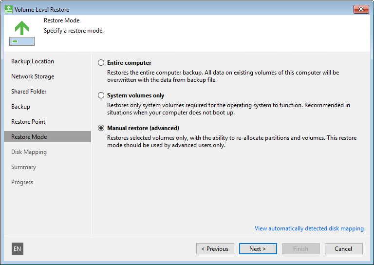

# Step 9. Select Data Restore Mode

At the Restore Mode step of the wizard, select the data restore mode:

* Entire computer — select this option if you want to restore the whole system image of your computer. In this case, Veeam Agent for Microsoft Windows will attempt to map volumes from the backup to existing computer volumes and will overwrite existing data with data restored from the backup.
* System volumes only — select this option if you want to restore only system state data and the system volume (volume on which the Microsoft OS is installed). In this case, Veeam Agent for Microsoft Windows will restore the Microsoft Windows system partition and boot partition from the backup to your computer. For GPT disks on Microsoft Windows 10, 11, 2012 R2, 2016, 2019, 2022 and 2025, Veeam Agent for Microsoft Windows will additionally restore the recovery partition.
* Manual restore — select this option if you want to choose what computer volumes you want to restore and manually allocate disk space on restored volumes. This option is recommended for users who have experience in working with Microsoft Windows disks and partitions.

To view the current disk allocations settings on your computer, at the bottom of the wizard click View automatically detected disk mapping.

|  |
| --- |
|  IMPORTANT |
| You will not be able to restore data in the Entire computer or System volumes only mode, if disks on a computer have not enough space to embed volume data from the backup. In this situation, you will be prompted to use the Manual restore mode. |

