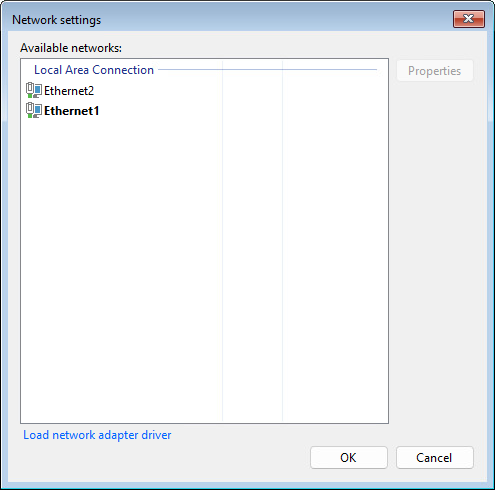
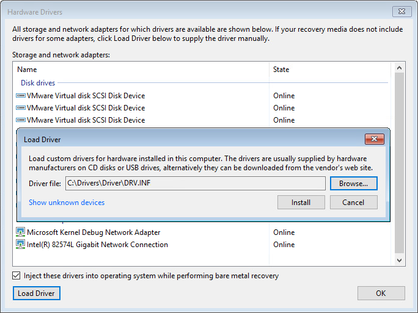

# Step 2. Select Network Adapter or Wireless Network

To open the Network settings window, click the Network Settings button at the bottom right corner of the Veeam Recovery Media screen.

|  |
| --- |
|  TIP |
| The Network Settings button appearance may vary depending on the detected network connection: Ethernet or wireless. If your computer is connected to a wireless network, the Network Settings button will indicate Wi-Fi signal strength. |

Select a network adapter or wireless network that you want to use to connect to the network shared folder or Veeam backup repository where the backup resides.

* If network connection settings are included in the Veeam Recovery Media, or if there is a DHCP server in your network, Veeam Agent for Microsoft Windows will configure the network settings automatically and display available network adapters in the list. The names of the adapters connected to the network will be displayed in bold.
* If you want to access the network shared folder or Veeam backup repository using a wireless network, select the necessary network in the list and click Next. If the wireless network is password protected, you will be prompted to specify a password for this network.
* You can manually configure TPC/IP v4 settings for adapters if necessary. To do this, select an adapter in the list and click Properties.

|  |
| --- |
|  NOTE |
| You will be prompted to configure network settings manually if Veeam Agent for Microsoft Windows does not detect available networks and there are no network settings included in the Veeam Recovery Media. |

Installing Network Adapter Drivers

The list of networks can be empty. This can happen in two situations:

* The driver for the network adapter is included in the Veeam Recovery Media but failed to be installed automatically for some reason.
* The driver for the network adapter is not included in the Veeam Recovery Media.

To install drivers that were included in the Veeam Recovery Media:

1. At the Network settings window, click Load network adapter driver.
2. In the Hardware Drivers window, select the necessary device.

If you want to include in the restored operating system all the drivers that were saved to the Veeam Recovery Media, select the Inject these drivers into operating system while performing bare metal recovery option. In case the option is not selected, the restored operating system will include only default Windows hardware drivers.

1. Click the Install link next to the selected device.

To install drivers that were not included in the Veeam Recovery Media:

1. At the Network settings window, click Load network adapter driver.
2. At the bottom of the Hardware Drivers window, click the Load Driver button and select the INF file in the driver package folder. You can also click the Show unknown devices link to see a list of all existing devices without drivers. This information may help you to identify the exact device for which you need to install the driver.
3. Click Install.

