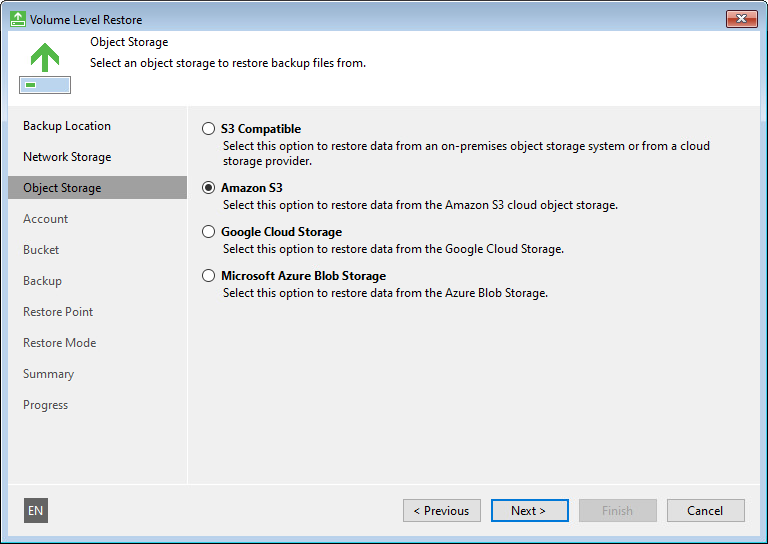

# Object Storage Settings

The Object Storage step of the wizard is available if you have chosen to restore data from a backup file located in object storage.

Specify settings for the object storage:

* [Specify S3 compatible settings](baremetal_s3_compatible.md).
* [Specify Amazon S3 settings](baremetal_amazon.md).

* [Specify Google Cloud Storage settings](baremetal_google.md).

* [Specify Microsoft Azure Blob Storage settings](baremetal_azure.md).

