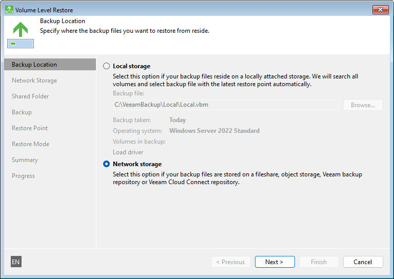

# Step 4. Specify Backup File Location

At the Backup Location step of the wizard, specify where the backup file that you want to use for data recovery is located.

By default, Veeam Agent for Microsoft Windows automatically locates the latest backup on the computer drive and you pass immediately to the [Restore Point](baremetal_point.md) step of the wizard. If Veeam Agent for Microsoft Windows fails to locate the backup on the local computer drive for some reason, or the backup file is located in object storage, in a network shared folder, in a backup repository or cloud repository, select where the backup file resides:

* Local storage — select this option if the backup file resides on the local computer drive, external drive or removable storage device that is currently connected to your computer. Click Browse and select a backup metadata file (VBM).
* Network storage — select this option if the backup file resides in object storage, in a network shared folder, in a backup repository managed by a Veeam backup server or in a cloud repository exposed to you by a Veeam Cloud Connect service provider. In this case, the Veeam Recovery Media wizard will include additional steps for specifying the backup file location settings.

Installing Drivers for Remote Storage Devices

A removable storage device with the backup file may not be displayed in the list of devices. This can happen in two situations:

* The driver for the remote storage device is included in the Veeam Recovery Media but failed to be installed automatically for some reason.
* The driver for the remote storage device is not included in the Veeam Recovery Media.

To install drivers that were included in the Veeam Recovery Media:

1. At the Backup Location step of the wizard, click Load driver.
2. In the Hardware Drivers window, select the necessary device.

If you want to include in the restored operating system all the drivers that were saved to the Veeam Recovery Media, select the Inject these drivers into operating system while performing bare metal recovery option. In case the option is not selected, the restored operating system will include only default Windows hardware drivers.

1. Click the Install link next to the selected device.

To install drivers that were not included in the Veeam Recovery Media:

1. At the Backup Location step of the wizard, click Load driver.
2. At the bottom of the Hardware Drivers window, click the Load Driver button and select the INF file in the driver package folder. You can also click the Show unknown devices link to see a list of all existing devices without drivers. This information may help you to identify the exact device for which you need to install the driver.
3. Click Install.

