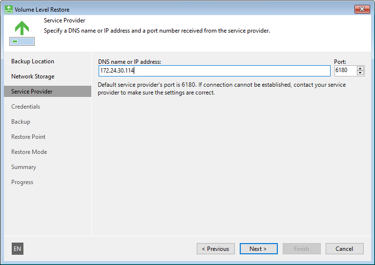

# Service Provider Settings

If you have selected to restore data from a backup file located in a Veeam Cloud Connect repository, specify settings to connect to the cloud repository:

1. [Specify service provider settings](#sp).
2. [Verify the TLS certificate and specify user account settings](#creds).

Specifying Service Provider Settings

The Service provider step of the wizard is available if you have chosen to restore data from a cloud repository exposed to you by a Veeam Cloud Connect service provider.

Specify service provider settings that the SP or your backup administrator has provided to you:

1. In the DNS name or IP address field, enter a full DNS name or IP address of the cloud gateway.
2. In the Port field, specify the port over which Veeam Agent for Microsoft Windows will communicate with the cloud gateway. By default, port 6180 is used.

Specifying User Account Settings

The Credentials step of the wizard is available if you have chosen to restore data from a cloud repository and specified settings for the cloud gateway.

Verify TLS certificate settings and specify settings for the tenant account or subtenant account that you want to use to connect to the service provider.

1. At the top of the wizard window, Veeam Agent for Microsoft Windows displays information about the TLS certificate obtained from the SP side. You can view the certificate settings and verify the TLS certificate.

TLS certificate verification is optional. You can use this option to verify self-signed TLS certificates. TLS certificates signed by the CA do not require additional verification.

* To view the TLS certificate, click the certificate link.
* To verify if the TLS certificate with a thumbprint, copy the thumbprint you obtained from the SP to the Clipboard and enter it to the Fingerprint for certificate verification field. Click Verify. Veeam Agent for Microsoft Windows will check if the thumbprint you enter matches the thumbprint of the obtained TLS certificate.

1. In the Username field, enter the user name of the tenant or subtenant account that the SP or your backup administrator has provided to you. The user name of the subtenant account must be specified in the TENANT\SUBTENANT format.
2. In the Password field, provide a password for the tenant or subtenant account.

